=====================
Formation à GNU/Linux
=====================

:author: Michaël Launay <michaellaunay@ecreall.com>
:version: 1.0
:licence: Cette création est mise à disposition selon le Contrat Paternité 2.0 France disponible en ligne http://creativecommons.org/licenses/by/2.0/fr/ ou par courrier postal à Creative Commons, 171 Second Street, Suite 300, San Francisco, California 94105, USA.

.. raw:: pdf

   PageBreak oneColumn

.. header::

   *Ecréall 2009*

.. footer::

   **###Title###** *Page : ###Page###*

.. contents::

.. section-numbering::

.. raw:: pdf

   PageBreak oneColumn

Objectif
========

Cette formation a pour but de fournir les bases indispensables à l'utilisation et à l'administration des systèmes GNU/Linux.

La formation priviliégie la distribution Ubuntu.

Introduction
============

En 1991, l'étudiant Finlandais Linus Torvalds publie sur internet l'intégralité du code source d'un noyau Unix qu'il a écrit en C et en assembleur et qui fonctionne sur PC AT 386(486).

Depuis cette date GNU/Linux ne cesse d'évoluer. Il occupe en 2015 1,6% [#]_ du marché mondial des systèmes d'exploitation pour ordinateur personnel, plus de 60% des serveurs web, prés de 75% du Cloud et plus de 80% des smartphones (Android étant basé sur GNU/Linux) et est en autre utilisé en France par la Gendarmerie (Ubuntu) et par l'Assemblée Nationale (Ubuntu), dans la Freebox, par l'entreprise Google (Android) et la fondation Wikipedia (serveur Ubuntu).

Historique
==========

UNIX (les racines)
------------------

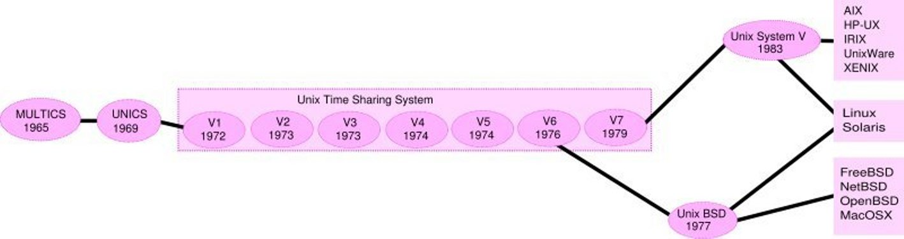

    Histoire des Unix (source wikipedia)

Ken Thompson, ingénieur d'AT&T travaille en collaboration avec le MIT au Bell Labs sur Multics.

En 1969 il créait un système d'exploitation inspiré de Multics. Brian Kernighan le nommera Unics.

En 1971 Unics devient Unix et est alors récrit en C spécialement développé pour cela par Dennis Ritchie.

1973 AT&T diffuse Unix avec ses sources à ses clients (première licence open source).

1974 l'Université de Californie Berkeley (UCB) commence ses recherches sur UNIX en collaboration étroite avec AT&T.

1977 Bill Joy alors étudiant à l'UCB réalise la première version de BSD (Berkeley Software Distribution).

A partir de là, les éditions se succèdent (SYSTEM III puis V en 1985 et SVR2 à SVR4 pour AT&T, 4.2BSD pour l'UCB en 1983).

La DARPA finance BSD ce qui aboutit à l'intégration de la première pile TCP/IP en 1983 qui sera intégrée telle quel dans Windows en raison de sa licence permissive.

1985 la 4.3 BSD n'est plus livrée avec les sources de AT&T en raison du prix excessif de la licence.

Face à ce problème, l'UCB réécrit et nettoie complètement son UNIX qui sort en 1989 sous le nom NetBSD. Le noyau est alors le MACH de l'université de Carnegie-Mellon. L'accès aux sources et à la distribution complète devient gratuit.

1991 Sun Microsystems co-fondé en 1982 par Bill Joy sort SunOS qui deviendra Solaris.

1992 Procès AT&T BSD

FreeBSD apparaît en 1993 comme le portage de NetBSD sur i386

1998 Solaris supporte le 64 bits

1999 Mac OS X (server)

2005 Open Solaris

Octobre 2008 version 4.0.1 de NetBSD

Janvier 2009 version 7.1 de FreeBSD

La Free Software Foundation (FSF), le projet GNU

1983 Richard Stallman (RMS) qui travaillait au laboratoire d'intelligence artificiel du MIT crée le projet GNU.

GNU est un acronyme récursif (GNU's Not Unix).

GNU a pour objectif de fournir un système d'exploitation compatible avec UNIX sans dépendre des ayant droits (AT&T et BSD) dont RMS récuse les licences.

1985 création de la Free Software Foundation (FSF) organisation Américaine à but non lucratif pour le soutien du logiciel libre.

1987 Rob Pike, Ken Thompson et Dennis Ritchie débute les travaux de Plan 9 qui inspirera les UNIX modernes.

1989 écriture de la GNU GPL (GNU Genral Public Licence ou  GPL) version 1.

1990 le système GNU possède son propre éditeur (Emacs), d'un compilateur C (GCC), et d'une réécriture de la plupart des bibliothèques système d'UNIX.

1991 le noyau Linux utilise la GPL et GCC.

1997 lancement de GNOME un environnement graphique dont l'objectif était de fournir une alternative libre à l'environnement KDE qui utilisait la bibliothèque Qt alors non libre.

La licence BSD versus la licence GPL
------------------------------------

Il existe presque plusieurs centaines de licences appliquées aux logiciels libres, mais dans la majorité des cas on peut les séparer en deux catégories selon qu'elles sont compatible avec la licence BSD ou la licence GPL.

La licence GPL
--------------

La licence GPL a pour but de protéger l'auteur et l'utilisateur en garantissant les droits suivants (appelés libertés) :

1. La liberté d'exécuter le logiciel, pour n'importe quel usage ;
2. La liberté d'étudier le fonctionnement d'un programme et de l'adapter à ses besoins, ce qui passe par l'accès aux codes sources ;
3. La liberté de redistribuer des copies ;
4. La liberté d'améliorer le programme et de rendre publiques les modifications afin que l'ensemble de la communauté en bénéficie.

En contrepartie l'utilisation du logiciel est au risque et péril de l'utilisateur.

Le gauche d'auteur
++++++++++++++++++

Le code n'est pas dans le domaine public.

Il est protéger par le droit d'auteur.

L'exécution du logiciel et la diffusion des sources modifiées n'est possible qu'à la condition de respecter les obligations de la licence.

Notamment :

  Le droit de redistribuer est garanti seulement si l'utilisateur fournit le code source de la version modifiée. En outre, les copies distribuées, incluant les modifications, doivent être aussi sous les termes de la GPL.

  Cette condition est connue sous le nom de copyleft.

  Puisque le logiciel est protégé par les droits d'auteurs, l'utilisateur ne peut le modifier ou le redistribuer, sauf sous les termes du copyleft. En conséquence l'utilisateur doit à son tour fournir les sources et placer ses modifications sous GPL.

Puisque le copyleft des versions 1 et 2 de la GPL ne s'appliquait pas aux entrées sorties du programme, il était possible dans le cas par exemple d'un service web de contourner l'obligation de diffusion des sources. De même, il suffisait de transformer tout code GPL en bibliothèque dynamique pour ne pas propager la GPL aux extensions apportées à un programme existant.

Cette faille a été corrigé avec la version GPL v3 qui accorde aux utilisateurs d’un programme accédé par réseau les mêmes droits que les utilisateurs d’un programme installé localement.

La GPL a été adaptée au droit Français par le CEA, CNRS, INRIA sous le nom de CECILL. Sa version 2 est compatible avec la licence publique générale GNU.

Le 28 mars 2007 le tribunal de grande instance de Paris a jugé applicable la licence GPL (v2).

La licence BSD
--------------

La licence BSD permet l'utilisation du logiciel et la réutilisation de n'importe quelle partie de son code source sans restriction. La seule obligation était la mention des auteurs initiaux.

Pour pouvoir utiliser le logiciel écrit sous licence BSD l'utilisateur accepte de ne pas se retourner contre les auteurs en cas de problèmes.

Un logiciel propriétaire peut donc être réalisé à partir du code source d'un logiciel BSD (C.f. pile TCP/IP dans Windows).

GNU/Linux
---------

Linux est développé sur internet par des milliers de contributeurs distants de nationalité et de culture différentes.
C'est l'un des projets collaboratifs les plus important.

Les distributions
=================

Qu'est ce qu'un noyau ?
-----------------------

Pour définir le noyau nous pouvons nous baser sur les services qu'il fournit :
 Abstraction du matériel (fourniture d'interface)
 Gestion des interruptions
 Gestion des tâches et autres logiciels
 Gestion des utilisateurs
 Gestion des droits d'accès

Historiquement on distingue les micro-noyaux des noyaux monolithiques.
Cette séparation vient de ce que le noyau est sensé gérer (kernel space) et donc de ce qui est de la responsabilité des utilisateurs (user space). Dans les faits aujourd'hui même les noyaux monolithiques comme Linux sont modulaires et ne charge les modules que si nécessaire pendant l'utilisation.

Qu'est ce qu'une distribution ?
-------------------------------

Une distribution est un ensemble cohérent de logiciels fourni avec un noyau (Linux ou BSD). Les logiciels sont choisis pour utiliser les mêmes versions de bibliothèque et être compatibles les uns avec les autres ce qui a pour conséquence d'augmenter la stabilité et d'améliorer l'utilisation.

Elles comprennent des outils d'installation et de configuration.

Il en existe de nombreuses couvrant des besoins et des usages différents (ordinateur personnel, de bureau, serveur, passerelle, intrusion, multimédia center), ou des matériels spécifiques.

Les différentes distributions GNU/Linux
---------------------------------------

Sont orientées vers les utilisateurs débutants :

 * Suse
 * Ubuntu Desktop,

Pour les serveurs :

 * Ubuntu Server
 * Debian
 * Gentoo
 * Red Hat
 * CentOS

Pour les développeurs :

 * Fedora
 * Red Hat

Les métas distributions :

 * Red hat -> Fedora, CentOS
 * Debian -> Ubuntu, Knoppix,
 * Gentoo -> Aurora

Les principales distributions
-----------------------------

Debian reste très orienté administrateur. Il est important d'être à l'aise avec la ligne de commande. Les versions stables sortent en moyenne tous les 2 ans.

Ubuntu reprend les outils Debian mais les versions sortent tous les 6 mois.

Gentoo permet une optimisation poussée du système. Il propose en priorité de compiler les sources de chacun des logiciels et donc de ne garder que les fonctionnalités voulues par l'utilisateur, en tenant compte des nombreux paramètres locaux.

Distributions commerciales :

 * Red Hat (http://www.redhat.com),
 * Novell/SUSE (http://www.novell.com/linux/).

Distributions "communautaires" :

 * Gentoo (http://www.gentoo.org)
 * CentOs (http://www.centos.org)
 * Debian (http://www.debian.org)
 * Fedora (http://fedoraproject.org/)
 * Ubuntu (http://www.ubuntu.com)

Linus Torvalds défend la multiplicité des distributions.

Installation
============

Le choix d'une distribution doit se faire en fonction :

 * du besoin technique,
 * des performances voulues,
 * de la pérennité désirée,
 * du niveau de sécurisation attendu.

Une fois ces exigences connues, il ne reste plus qu'à se procurer les images des distributions adéquates soit directement sur les sites des distributions, soit sur un miroir.

Installation de GNU/Linux Ubuntu version pc de bureau
-----------------------------------------------------

Les versions desktop d'Ubuntu sont fournies avec l'environnement graphique Gnome, des outils de maintenance, la suite open-office, le lecteur de courrier evolution, le logiciel de dessin Gimp, le navigateur firefox, un client vnc permettant de se connecter à distance, des jeux, des logiciels multimédias.

Elles conviennent parfaitement à un poste de travail mais sont à proscrire pour un serveur en raison du nombre de services fonctionnant par défaut.

Installation d'Ubuntu 16.04
++++++++++++++++++++++++++

Mettre le CD dans lecteur DVD, ou une clé usb bootable et démarrer dessus l'ordinateur.

Dans le cas d'une installation virtuelle depuis un poste GNU/Linux, il est possible de monter l'image iso comme un CD : ::

 mkdir /home/michaellaunay/VCD
 sudo mount -t iso9660 -o loop /home/michaellaunay/Download/ubuntu-9.04-desktop-i386.iso /home/michaellaunay/VCD

Étape 01 :

.. figure:: Installation01ChoixDeLaLangue.jpg
       :align: center

       Choix de la langue du live cd

Étape 02 :

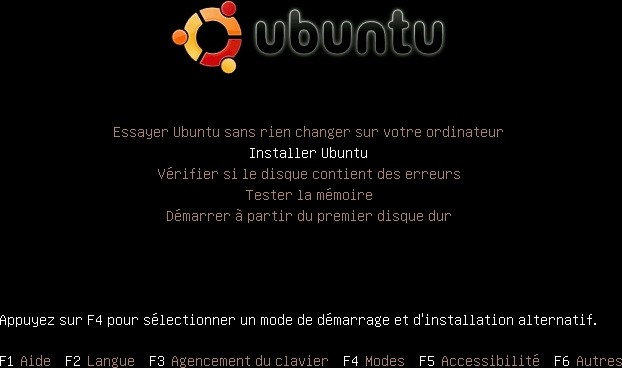

       Lancement de l'installation

Étape 03 :

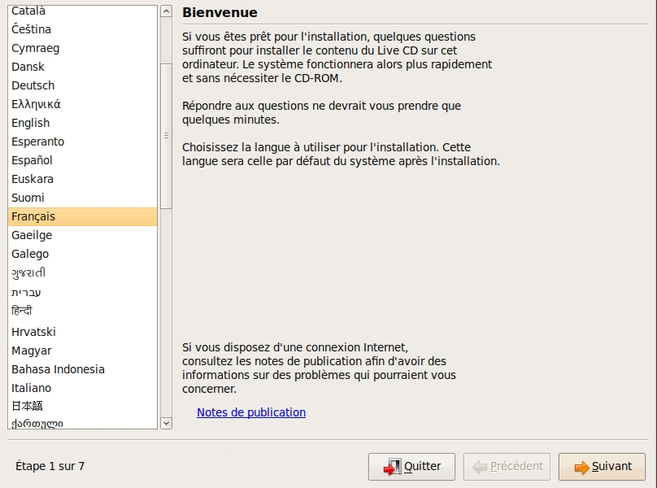

       Choix de la langue du système à installer

Étape 04 :

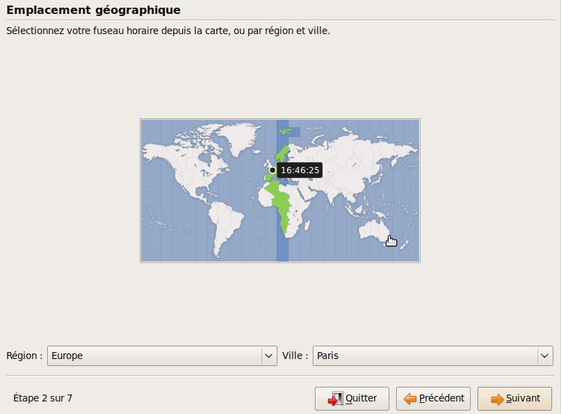

       Choix du fuseau horaire

Étape 05 :

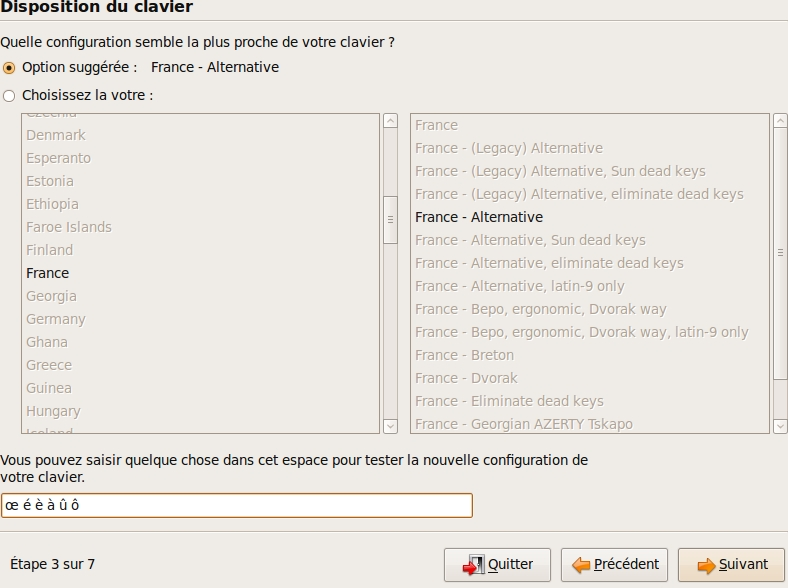

       Choix du clavier

Étape 06 :

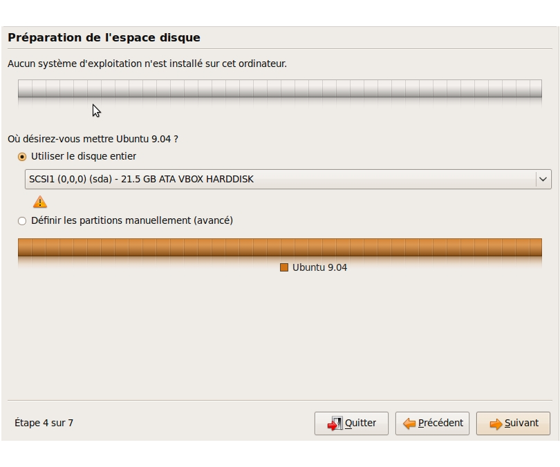

       Choix du partitionnement

Le partitionnement est l'étape la plus importante car il est difficile de corriger les erreurs.

Pour les serveurs cette étape influence directement la sécurité du système (/var/lib, /var/log, /var/spool, /var/www, /tmp), la sécurité est alors physique et ne repose pas seulement sur le mécanisme des quotas. De plus, l'analyse post-mortem d'une partition dédiée est plus facile que celle d'un énorme fourretout.

Au minimum, il est recommandé d'avoir une partition /, /home et swap.

Pour activer le partitionnement manuel il suffit de cocher sur "Définir les partitions manuellement".

Étape 07 :

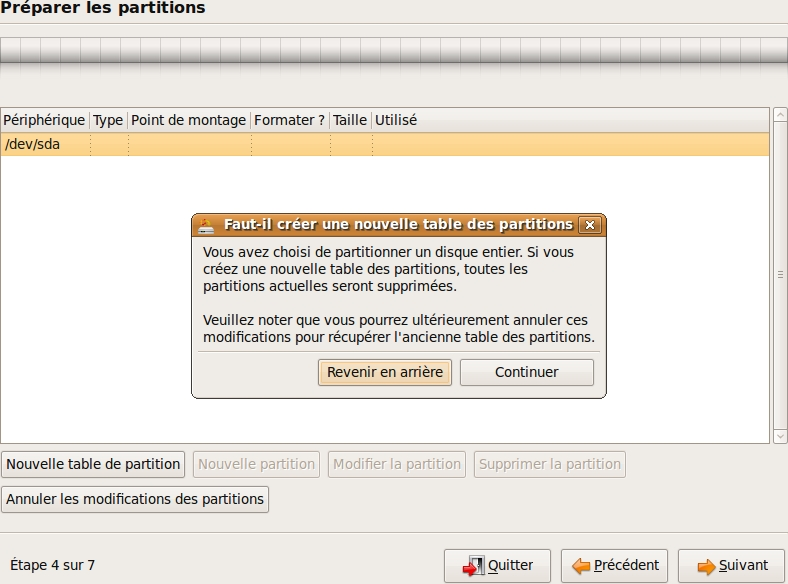

       Création d'une nouvelle table de partition

Étape 08 :

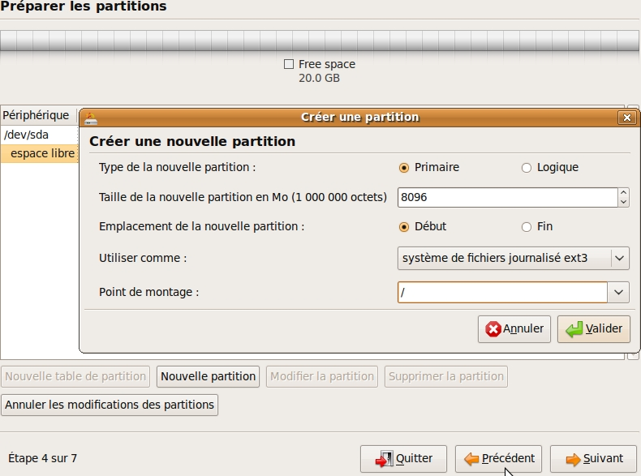

       Création d'une nouvelle partition

Dans notre cas nous allons créer 3 partitions /, /home et swap.

La taille du swap doit être au moins égale à celle de la RAM afin de permettre l'hibernation.

Étape 09 :

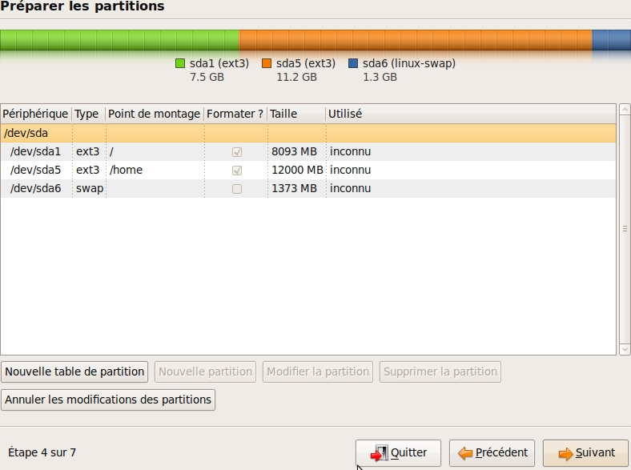

       Création des partitions

Étape 10 :

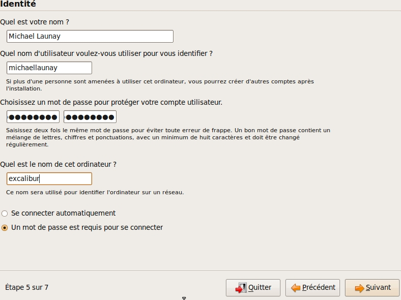

       Création du 1er compte utilisateur

Sous Ubuntu cet utilisateur aura la particularité de pouvoir mettre à jour le système et plus généralement de pouvoir devenir super utilisaterur (root).

Étape finale:

Ubuntu affiche un récapitulatif des choix réalisés, la confirmation lance alors le partitionnement des disques, leur formatage puis l'installation du système.

Installation de GNU/Linux Ubuntu en version serveur
---------------------------------------------------

La philosophie des distributions serveur est moins il y a de programmes installés plus le système est stable et moins il y a de faille de sécurité.

En conséquence les interfaces graphiques ne sont disponible qu'en option et le moyen privilégié d'administrer le système est la ligne de commande.

Pour un serveur il vaut mieux opter pour les version LTS (Long Term Support) des distributions.

Les différences entre Debian server et Ubuntu server sont liées aux versions du noyau et des bibliothèques utilisées, aux dépôts et fichiers de configurations par défaut.

Attention
+++++++++

Sous Ubuntu, il n'est pas possible de créer une partition /var car le système y stocke des fichiers au démarrage, alors que les points de montage ne sont pas encore installés, ce qui provoque un plantage du système difficile à comprendre.

Travaux pratiques
+++++++++++++++++

Installation d'une Ubuntu server LTS

Utilisation de GNU/Linux
------------------------

Présentation interactive du système d'exploitation:

 * le bureau,
 * les fenêtres d'application,
 * le tableau de bord.

Administration graphique du système:

 * Configuration du réseau (Système > Préférences > Network Configuration)
 * Synaptic : l'installation de logiciels (Système > Administration > Gestionnaire de paquets Synaptic)
 * configuration des dépôts (Système > Administration > Sources de logiciels)
 * les applets
 * la résolution graphique
 * les bureaux virtuels
 * les services (Système > Administration > Services)

Les logiciels d'administration ne sont que des sur-couches graphiques (front-end) qui appellent les commandes en ligne, par conséquent leur possibilités sont moindres.

L'aide et la communauté
=======================

L'aide en ligne
---------------

En mode graphique, les applications possèdent un onglet "Aide" permettant d'ouvrir un navigateur sur l'aide en ligne. Cette aide est généralement accessible par la touche F1.

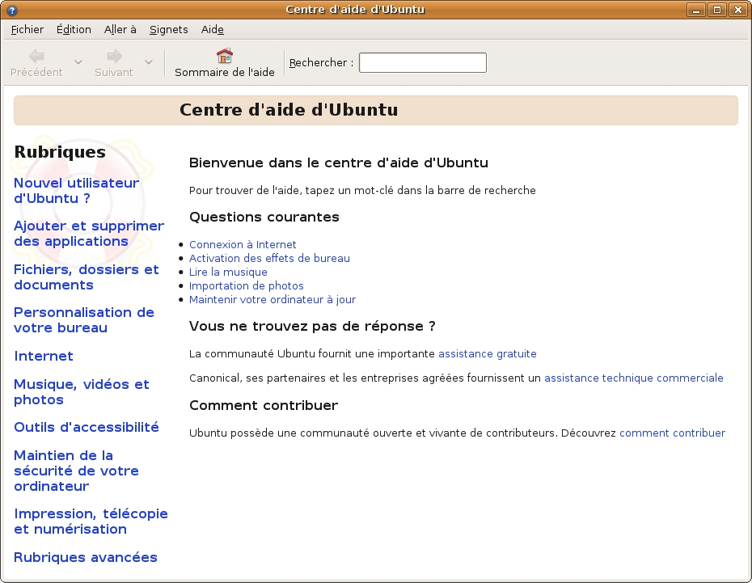

    Aide en ligne d'Ubuntu (appelée avec F1)

Dans un shell, la plupart des commandes unix acceptent l'option -h ou --help ou --usage : ::

  michaellaunay@luciole:~$ apropos --help
  Usage: apropos [OPTION...] KEYWORD...
  Project-Id-Version: man-db 2.3.90
  Report-Msgid-Bugs-To: Colin Watson <cjwatson@debian.org>
  POT-Creation-Date: 2008-05-05 02:09+0100
  PO-Revision-Date: 2008-08-19 20:37+0000
  Last-Translator: Laurent Pelecq <laurent.pelecq@soleil.org>
  Language-Team: French <traduc@traduc.org>
  MIME-Version: 1.0
  Content-Type: text/plain; charset=UTF-8
  Content-Transfer-Encoding: 8bit
  X-Launchpad-Export-Date: 2008-11-09 09:58+0000
  X-Generator: Launchpad (build Unknown)

    -d, --debug                emit debugging messages
    -v, --verbose              print verbose warning messages
    -e, --exact                search each keyword for exact match
    -r, --regex                interpret each keyword as a regex
    -w, --wildcard             the keyword(s) contain wildcards
    -a, --and                  require all keywords to match
    -l, --long                 do not trim output to terminal width
    -C, --config-file=FICHIER  use this user configuration file
    -L, --locale=LOCALE        define the locale for this search
    -m, --systems=SYSTEM       use manual pages from other systems
    -M, --manpath=CHEMIN       set search path for manual pages to PATH
    -s, --section=SECTION      search only this section
    -?, --help                 give this help list
        --usage                give a short usage message
    -V, --version              print program version

  Mandatory or optional arguments to long options are also mandatory or optional
  for any corresponding short options.

  The --regex option is enabled by default.

  Report bugs to cjwatson@debian.org.

Pour trouver une commande il suffit de faire apropos MotClé qui affichera toutes les commandes comportant MotClé dans sa description courte. Toutefois la base des commandes peut avoir besoin d'être régénérée par **makewhatis**.

*whatis NomDeCommande* affichera la description courte de NomDeCommande.

Les man pages
-------------

Les applications et commandes possèdent toutes un manuel accessible en ligne de commande via la commande man.

Ce manuel est généralement traduit dans la langue de l'utilisateur ::

  michaellaunay@luciole:~$ man man
  MAN(1)            Utilitaires de l’afficheur des pages de manuel               MAN(1)

  NOM
         man - Interface de consultation des manuels de référence en ligne

  SYNOPSIS
         man  [-c|-w|-tZ] [-H[navigateur]] [-T[périphérique]] [-adhu7V] [-i|-I]
         [-m système[,...]] [-L langue] [-p chaîne] [-C fichier] [-M chemin]
         [-P afficheur] [-r invite] [-S liste] [-e extension] [[section] page ...] ...
         man -l [-7] [-tZ] [-H[navigateur]] [-T[périphérique]] [-p chaîne]
         [-P afficheur] [-r invite] fichier ...
         man -k [apropos options] expression_rationnelle ...
         man -f [whatis options] page ...

  DESCRIPTION
         man est le programme de visualisation des pages de manuel.  Chacun  des  argu-
         ments  page,  indiqué dans la ligne de commande de man, porte, en principe, le
         nom d’un programme, d’un utilitaire ou d’une fonction. La page de manuel  cor-
         respondant à chaque argument est alors trouvée et affichée. Si une section est
         précisée alors man limite  la  recherche  à  cette  section.  Par  défaut,  il
         recherche dans toutes les sections disponibles, suivant un ordre prédéfini. Il
         n’affiche que la première page de manuel trouvée, même si  d’autres  pages  de
         manuel existent dans d’autres sections.

         Le  tableau  ci-dessous  indique le numéro des sections de manuel ainsi que le
         type de pages qu’elles contiennent.

         1   Programmes exécutables ou commandes de l’interpréteur de  com-
             mandes (shell) ;
         2   Appels système (Fonctions fournies par le noyau) ;
         3   Appels  de  bibliothèque  (fonctions  fournies  par  les  bib-
             liothèques des programmes) ;
         4   Fichiers spéciaux (situés généralement dans /dev) ;
         5   Formats des fichiers et conventions. Par exemple /etc/passwd ;
         6   Jeux ;
         7   Divers (y compris les macropaquets et les  conventions).   Par
             exemple, man(7), groff(7) ;
         8   Commandes  de  gestion  du  système (généralement réservées au
             superutilisateur) ;
         9   Sous-programmes du noyau [hors standard].

         Une page de manuel est constituée de plusieurs parties.

         Elles peuvent être libellées NOM, SYNOPSIS,  DESCRIPTION,  OPTIONS,  FICHIERS,
         VOIR AUSSI, BOGUES et AUTEUR.

Pour chercher les pages associées à un mot clé::

  michaellaunay@luciole:~/Documents/ecreall/Cours/CoursGNULinux$ man -k manual
  apropos (1)          - search the manual page names and descriptions
  catman (8)           - create or update the pre-formatted manual pages
  esdcompat (1)        - manual page for pulseaudio esd wrapper 0.9.5
  grub-reboot (8)      - manual page for grub-reboot 0.01
  man (1)              - an interface to the on-line reference manuals
  manconv (1)          - convert manual page from one encoding to another
  mandb (8)            - create or update the manual page index caches
  manpath (1)          - determine search path for manual pages
  missing (7)          - missing manual pages
  pulseaudio (1)       - manual page for pulseaudio 0.9.5
  readahead-list (8)   - manual page for readahead-list: 0.20050517.0220
  readahead-watch (8)  - manual page for readahead-watch: 0.20050517.0220
  update-apt-xapian-index (8) - manual page for update-apt-xapian-index 0.15
  w3mman (1)           - an interface to the on-line reference manuals by w3m(1)
  whatis (1)           - display manual page descriptions
  whereis (1)          - locate the binary, source, and manual page files for a command
  xman (1)             - Manual page display program for the X Window System

Les sites
---------

Le site officiel de Linux http://www.linux.org

Un site dédié à Linux (Linux Entre Amis) : http://www.lea-linux.org

Une présentation de Linux http://fr.wikipedia.org/wiki/Linux

La communauté ubuntu française http://www.ubuntu-fr.org/

Les forums
----------

Le forum de la communauté Ubuntu http://ubuntuforums.org/

Le forum de la communauté Debian française http://forum.debian-fr.org

Les LUGs
--------

Un LUG est un groupe d'utilisateurs de Linux (Linux User Group) réuni généralement au sein d'une association loi 1901.

Dans la région lilloise on compte essentiellement Chtinux http://www.chtinux.org/ anciennement Campux et CLX http://clx.anet.fr/

Les LUGs réalisent la promotion de Linux est des logiciels libres. Ils organisent des manifestations telles que des install party.

Shell & Commandes
=================

Les terminaux (tty)
-------------------

Historiquement, un terminal est une interface homme machine minimale issue des technologies de communication de la fin XIX et du début XX siècle, le Télétype marque déposée en 1906 est l'ancêtre des claviers numériques des premiers ordinateurs.

L'abréviation tty de Télétype a été utilisée pour décrire l'interface série de communication utilisée au début d'Unix. Par usage c'est le terme qui décrit l'interface de saisie et d'affichage avec l'humain. On trouve aussi l'appellation de terminal ou console.

La commande tty affiche le pseudo fichier associé à la saisie.

Dans l'environnement graphique XWindows on trouve des logiciels émulant les terminaux, on les appelle alors des terminaux virtuels (ex: xterm).

Les terminaux ne sont en charge que de la récupération des touches frappées, de leur transformation en lettre, et de l'affichage de celle-ci. L'interprétation de ce qui est saisi est dévolue au shell.

Les six premiers terminaux sont accessibles par la combinaison de touche Ctrl Alt F[1-6].

Le terminal graphique est accessible Ctrl Alt F7

La ligne de commande
--------------------

Sous Unix la CLI (Command Line Interface) est la méthode privilégiée pour transmettre au système les ordres à exécuter.

Les différents shell
++++++++++++++++++++

Le shell est un logiciel qui interprète séquentiellement les commandes saisies dans un terminal ou stockées dans un fichier (script) ou provenant d'un pseudo fichier.

La syntaxe et la sémantique de cette interprétation dépendent du shell employé.

Historiquement la première version est **sh** (1977 écrit par Stephen Bourne) qui évolua en **csh**, **ksh** et **bash** (Bourne again shell) le plus répandu.

Bash est l'interpréteur de commande par défaut des Unix libres et de Mac OS X.

Pour connaitre la version de bash en cours d'utilisation::

  michaellaunay@luciole:~$ echo $BASH
  /bin/bash
  michaellaunay@luciole:~$ echo $BASH_VERSION
  4.3.39(1)-release

Pour modifier le shell par défaut associé à un utilisateur il faut modifier */etc/passwd* avec la commande **usermod -s /bin/bash login** : ::

  michaellaunay@luciole:~$ grep michael /etc/passwd
  michaellaunay:x:1000:1000:Michael Launay,,,:/home/michaellaunay:/bin/bash
  michaellaunay@luciole:~$ sudo usermod -s /bin/sh michaellaunay
  michaellaunay@luciole:~$ grep michael /etc/passwd
  michaellaunay:x:1000:1000:Michael Launay,,,:/home/michaellaunay:/bin/sh

  michaellaunay@luciole:~$ man 5 passwd
  PASSWD(5)                   Formats et conversions de fich                   PASSWD(5)

  NOM
       passwd - fichier des mots de passe

  DESCRIPTION
       /etc/passwd contient différentes informations sur les comptes utilisateurs. Ces
       informations consistent en sept champs séparés par des deux-points (« : ») :

       ·   nom de connexion de l´utilisateur (« login »)

       ·   un mot de passe chiffré optionnel

       ·   l´identifiant numérique de l´utilisateur

       ·   l´identifiant numérique du groupe de l´utilisateur

       ·   le nom complet de l´utilisateur ou un champ de commentaires

       ·   le répertoire personnel de l´utilisateur

       ·   l´interpréteur de commandes de l´utilisateur (optionnel)

       Le champ du mot de passe chiffré peut être vide. Dans ce cas, aucun mot de
       passe n´est nécessaire pour s´authentifier avec le compte donné. Cependant,
       certaines applications qui lisent le fichier /etc/passwd peuvent décider de ne
       donner aucun accès si le mot de passe est vide. Si le mot de passe est un « x »
       minuscule, alors le mot de passe chiffré se trouve dans le fichier shadow(5) ;
       il doit y avoir une ligne correspondante dans le fichier shadow, sinon le
       compte de l´utilisateur n´est pas valide. Si le mot de passe est constitué
       d´une autre chaîne, alors il est considéré comme un mot de passe chiffré, comme
       indiqué dans crypt(3).

Plus d'information : man bash

Lien : http://fr.wikipedia.org/wiki/Bourne-Again_shell

Les fichiers de ressources et de configuration de bash
++++++++++++++++++++++++++++++++++++++++++++++++++++++

Au lancement du shell celui-ci détermine s'il a été appelé de façon interactive ou pour exécuter un script ou en tant que shell de login. En fonction de la nature de son lancement il exécutera plusieurs fichiers lui permettant de ce paramétrer.

Scripts exécutés lors du lancement d'un shell interactif en ouverture de session (interactive login shell) : ::

 /etc/profile
 ~/.bash_profile #le ~ désigne le répertoire "home" de l'utilisateur
 ~/.bash_login #si ~/.bash_profile n'existe pas
 ~/.profile #si ~/.bash_login

Scripts exécutés lors d'un shell interactif : ::

 /etc/bash.bashrc
 ~/.bashrc

La modification de ces scripts nécessite la commande **source** pour une prise en compte immédiate dans le shell courant.

Scripts exécutés lors d'un script : ::

  $BASH_ENV #BASH_ENV est une variable. Si elle existe alors le shell essaye d'exécuter le fichier désigné par $BASH_ENV

Un petit exemple : ::

  michaellaunay@luciole:~$ echo "echo coucou" > /tmp/hello.sh #on crée un fichier hello.sh qui contient echo coucou
  michaellaunay@luciole:~$ chmod +x /tmp/hello.sh   # on rend exécutable ce fichier
  michaellaunay@luciole:~$ /tmp/hello.sh            # on exécute ce fichier
  coucou
  michaellaunay@luciole:~$ echo $BASH_ENV           # on affiche le contenu de la variable BASH_ENV

  michaellaunay@luciole:~$ BASH_ENV='/tmp/hello.sh' # on affecte la chaîne /tmp/hello.sh à la variable BASH_ENV
  michaellaunay@luciole:~$ export BASH_ENV # maintenant BASH_ENV sera accessible à toute commande exécutée depuis le shell courant
  michaellaunay@luciole:~$ echo "echo cuicui" > /tmp/oiseau.sh
  michaellaunay@luciole:~$ bash /tmp/oiseau.sh # on exécute oiseau.sh avec bash car on n'a pas fait le chmod +x dessus
  coucou
  cuicui

Les variables d'environnement
+++++++++++++++++++++++++++++

Les variables d'environnement sont accessibles en consultation avec la commande **env** : ::

  michaellaunay@luciole:~$ env
  SHELL=/bin/bash
  TERM=xterm
  HISTSIZE=1000
  USERNAME=michaellaunay
  PATH=/usr/local/sbin:/usr/local/bin:/usr/sbin:/usr/bin:/sbin:/bin
  PWD=/home/michaellaunay
  EDITOR=vim
  LANG=fr_FR.UTF-8
  HOME=/home/michaellaunay
  LOGNAME=michaellaunay
  DISPLAY=:0.0

Signification des variables d'environnement : ::

  BASH      # Le nom du fichier bash
  DISPLAY   # Le numéro de serveur et de session d'affichage
  EDITOR    # L'éditeur à utiliser par défaut
  HISTSIZE  # La taille de du fichier historique
  HOSTNAME  # Le nom de la machine
  HOME      # Le répertoire personnel de l'utilisateur
  LANG      # La langue de l'utilisateur et l'encodage utilisé pour afficher cette langue
  LOGNAME   # Le nom d'utilisateur lors de l'ouverture de la session
  MAIL      # Le chemin vers la boite mail de l'utilisateur
  PATH      # Le chemin vers les exécutables
  PS1       # Permet de constituer l'invite de commande
  PS2       # Symbole affiché sur les lignes de commande débordant sur plusieurs lignes
  PROMPT_COMMAND # Le nom d'une commande à exécuter à chaque commande
  PWD       # Le chemin actuel
  SHELL     # Le shell de l'utilisateur
  TERM      # Le type de terminal
  USERNAME  # Le nom d'utilisateur

Pour accéder au contenu d'une variable il suffit de la référencer en la précédent de **$**::

  michaellaunay@luciole:~$ echo $HOME
  /home/michaellaunay

Pour voir l'ensemble des définitions réalisées dans un shell (variable et fonction) il suffit de taper **set**.

Les caractères spéciaux
+++++++++++++++++++++++

Les caractères suivants permettent de déclencher des comportements particuliers qui seront expliqués ci-après : ::

 # # Mise en commentaire
 > # Indirection vers un fichier
 < # Indirection depuis un fichier
 | # Pipe
 ? # Un caractère ou pas
 . # Un caractère
 * # Une chaîne de caractère
 $ # Référencement d'une variable
 \ # Échappement
 / # Séparateur
 [ # Début d'un ensemble ou d'un test
 ] # Fin d'un ensemble ou d'un test
 ( # Sous shell ou évaluation
 ) # Fin de sous shell ou d'évaluation
 : # Séparateur de groupe
 ; # Fin de commande
 ^ # Inversion ou début
 @ # Adresse
 ` # Début ou fin d'interprétation
 ~ # Désigne le répertoire personnel

Si vous voulez les utiliser pour nommer par exemple un fichier sans que le comportement particulier soit déclenché vous avez l'obligation de les échapper avec **\** ou de les mettre entre apostrophes **'** ou guillemets **"**::

 \# ou '#' ou "#"
 \> ou '>' ou ">"
 \< ou '<' ou "<"
 \| ou '|' ou "|"
 \? ou '?' ou "?"
 \. ou '.' ou "."
 \* ou '*' ou "*"
 \$ ou '$' ou "$"
 \\ ou '\' ou "\"
 \/ ou '/' ou "/"
 \[ ou '[' ou "["
 \] ou ']' ou "]"
 \( ou '(' ou "("
 \) ou ')' ou ")"
 \: ou ':' ou ":"
 \; ou ';' ou ";"
 \^ ou '^' ou "^"

exemple : ::

  michaellaunay@luciole:~$ echo lunettes > /tmp/\[\*\]\^\["*"']'
  michaellaunay@luciole:~$ ls /tmp
  [*]^[*]
  michaellaunay@luciole:~$ cat /tmp/\[\*\]\^\[\*\]
  lunettes

Variables spéciales
+++++++++++++++++++

En plus des variables d'environnement vue précédemment nous avons : ::

  $? # Qui fait référence au code de retour de la dernière commande exécuté.
  $$ # Le pid du programme en cours d'exécution.
  $! # Le pid de la dernière commande lancée en tâche de fond.
  $# # Le nombre de paramètres.
  $0 # Le nom du programme en cours d'exécution.
  $1 # Le premier paramètre passé.
  $2 # Le second paramètre passé.
  ...
  $9 # Le neuvième paramètre.
  $*, $@ # L'ensemble des paramètres

Création, affectation de variable
+++++++++++++++++++++++++++++++++

Pour créer une variable ou en modifier sa valeur il suffit de la définir : ::

  michaellaunay@luciole:~$ VAR='Bonjour tout le monde'
  michaellaunay@luciole:~$ echo $VAR
  Bonjour tout le monde
  michaellaunay@luciole:~$ VAR=Salut
  michaellaunay@luciole:~$ echo $VAR
  Salut
  michaellaunay@luciole:~$ VAR=$VAR' à tous'
  michaellaunay@luciole:~$ echo $VAR
  Salut à tous
  michaellaunay@luciole:~$ PATH=/home/michaellaunay/MesScripts:$PATH
  michaellaunay@luciole:~$ echo $PATH
  /home/michaellaunay/MesScripts:/usr/local/sbin:/usr/local/bin:/usr/sbin:/usr/bin:/sbin:/bin

Pour supprimer une variable on peut utiliser **unset** : ::

  michaellaunay@luciole:~$ unset BASH_ENV

Export de variable
++++++++++++++++++

Toute variable créée dans un shell n'est accessible que dans celui-ci.

Pour la rendre accessible aux commandes et scripts appelés après l'affectation il faut l'exporter : ::

  michaellaunay@luciole:~$ echo "echo \$SALUTATION" > /tmp/cmd.sh
  michaellaunay@luciole:~$ /tmp/cmd.sh

  michaellaunay@luciole:~$ SALUTATION=coucou
  michaellaunay@luciole:~$ echo $SALUTATION
  coucou
  michaellaunay@luciole:~$ /tmp/cmd.sh

  michaellaunay@luciole:~$ export SALUTATION
  michaellaunay@luciole:~$ /tmp/cmd.sh
  coucou

Les tests d'expressions et fichier, opérateurs de contrôle
++++++++++++++++++++++++++++++++++++++++++++++++++++++++++

La commande **test** permet de tester une expression et de retourner 0 si le test est vrai et 1 s'il est faux : ::

  michaellaunay@luciole:~$ test 1 = 1
  michaellaunay@luciole:~$ echo $?
  0
  michaellaunay@luciole:~$ test 1 = 2
  michaellaunay@luciole:~$ echo $?
  1

On peut aussi remplacer **test** par des crochets mais il faut alors encadrer les crochets par des espaces : ::

  michaellaunay@luciole:~$ [ 1 = 2 ]
  michaellaunay@luciole:~$ echo $?
  1

Les options de test sont très nombreuses. Faites man test.

Avec **test** et **if** il est possible d'exécuter conditionnellement des commandes : ::

  michaellaunay@luciole:~$ VAR=2
  michaellaunay@luciole:~$ if [ $VAR = 2 ]; then echo Vrai; else echo Faux;fi
  Vrai
  michaellaunay@luciole:~$ VAR=$HOME
  michaellaunay@luciole:~$ if [ -w $VAR ]
  > then echo écriture possible dans $VAR
  > else echo écriture impossible dans $VAR
  > fi
  écriture possible dans /home/michaellaunay

Exécution d'opérations arithmétiques
++++++++++++++++++++++++++++++++++++

La construction **$[ nombre1 opérateur nombre2 ]** permet de réaliser le calcul d'expression sur des entiers : ::

  michaellaunay@luciole:~$ echo $[ 10 - 1 ]
  9

La boucle while et until
++++++++++++++++++++++++

**While** permet d'exécuter des commandes tant que la condition est satisfaite alors que **until** exécute des commandes tant que la condition échoue.

Exemple : ::

  michaellaunay@luciole:~$ VAR=4
  michaellaunay@luciole:~$ while [ $VAR -gt 0 ]
  > do
  > echo itération $VAR;
  > VAR=$[ $VAR - 1 ]
  > done
  itération 4
  itération 3
  itération 2
  itération 1

La boucle for
+++++++++++++

Pour chaque élément d'un ensemble on exécute une commande : ::

  michaellaunay@luciole:~$ NORD="Lille Roubaix"
  michaellaunay@luciole:~$ CENTRE="Paris Chartres"
  michaellaunay@luciole:~$ SUD="Nice Marseille"
  michaellaunay@luciole:~$ for ville in $NORD $CENTRE $SUD
  > do
  > echo Visiter $ville
  > done
  Visiter Lille
  Visiter Roubaix
  Visiter Paris
  Visiter Chartres
  Visiter Nice
  Visiter Marseille

Le choix multiple (case)
++++++++++++++++++++++++

Permet de réaliser un branchement. Ne pas oublier les deux point-virgules à la fin d'un cas : ::

  michaellaunay@luciole:~$ VAR=Lille
  michaellaunay@luciole:~$ case $VAR in
  > 'lille' | 'Lille' | 'LILLE' )
  >   echo J\'y habite
  > ;;
  > 'paris' | 'Paris' | 'PARIS' )
  >   echo J\'y ai habité
  > ;;
  > * )
  >   echo Je ne connais pas
  > ;;
  > esac
  J'y habite

Les opérateurs && et ||
+++++++++++++++++++++++

L'opérateur **&&** permet d'exécuter la commande suivante si la commande précédente réussie (retourne 0) : ::

  michaellaunay@luciole:~$ grep refusée /var/log/user.log > /tmp/connexion.txt && vim /tmp/connexion.txt

L'opérateur **||** permet d'exécuter la commande suivante si la commande précédente a échoué (retour de 1) : ::

  michaellaunay@luciole:~$ grep refusée /var/log/user.log > /dev/null || echo tout va bien

La commande trap
++++++++++++++++

Elle permet de positionner une fonction qui sera exécuté lors de la réception d'un signal (man 7 signal) : ::

  trap "echo Fin d\'exécution" EXIT
  trap "echo Interruption violente Ctrl-c" SIGINT
  trap "echo Fin demandée" SIGTERM
  trap "echo Reprise d\'exécution" SIGCONT
  trap "echo Signal USR" SIGUSR1 SIGUSR2

Les scripts
+++++++++++

Un script est un fichier qui contient une suite de commandes.

La première ligne permet d'indiquer le shell dans lequel doit être exécuté le script : ::

   #!/bin/bash
   echo c\'est du bash

Cette ligne s'appelle le shebang_.

Les fonctions
+++++++++++++

Une fonction est une portion de code nommée réutilisable qui a accès à toutes les variables du script ou du shell d'où elle est appelée : ::

  michaellaunay@luciole:~$ function carré() {
  > echo $[ $1 * $1]
  > }
  michaellaunay@luciole:~$ carré 3
  9

Lecture des saisies clavier
+++++++++++++++++++++++++++

La commande **read** permet de lire la saisie clavier et de l'affecter avec une variable : ::

  michaellaunay@luciole:~$ read VAR
  coucou
  michaellaunay@luciole:~$ echo $VAR
  coucou

Exercice
++++++++

Réalisez une calculatrice demandant la saisie de la première opérande puis de l'opérateur (symbole ou littéral), puis de la seconde opérande. Affichez le résultat puis exécutez à nouveau tant que le signal SIGUSR1 n'est pas reçu.

Les sous-programmes
+++++++++++++++++++

Dans un shell on peut appeler un script directement en passant son nom si celui-ci est exécutable ou en le faisant interpréter par le shell pour lequel il a été écrit.

Lorsqu'on exécute un ensemble de commandes encadré par des parenthèses alors le shell courant démarre un sous shell pour exécuter les commandes : ::

  michaellaunay@luciole:~$ VAR=0
  michaellaunay@luciole:~$ (VAR=$[ $VAR + 1]; echo $VAR)
  1
  michaellaunay@luciole:~$ echo $VAR
  0

Il est également possible de forcer l'exécution de commande en utilisant **`** : ::

  michaellaunay@luciole:~$ echo date
  date
  michaellaunay@luciole:~$ echo `date`
  samedi 2 mai 2009, 11:01:49 (UTC+0200)

La complétion de commande
+++++++++++++++++++++++++

En appuyant sur la touche tab le shell affiche toutes les commandes ayant pour préfixe les lettres déjà saisies sur la ligne de commande.

Historique des commandes
++++++++++++++++++++++++

Les commandes saisies dans un shell sont enregistrées dans le fichier ~/.bash_history

Il est possible d'accéder aux anciennes commandes en utilisant les flèches.

Les commandes
-------------

Se déplacer dans l'arborescence
+++++++++++++++++++++++++++++++

Les commandes : ::

  ls        # Permet d'afficher les informations d'un fichier ou d'un répertoire
  ls UnChemin # Affiche le contenu de UnChemin si c'est un répertoire, sinon affiche le nom de UnChemin
  ls -lah   # Affiche les détails, les fichiers cachés, et utilise des unités informatiques
  cd        # Permet de déplacer le répertoire courant
  pwd       # Affiche le chemin du répertoire courant

exemple : ::

  michaellaunay@luciole:~/Documents/ecreall/Cours$ ls -lh /
  total 124K
  drwxr-xr-x   2 root root 4,0K 2009-03-11 09:09 bin
  drwxr-xr-x   3 root root 4,0K 2009-04-16 09:11 boot
  lrwxrwxrwx   1 root root   11 2009-03-01 21:23 cdrom -> media/cdrom
  drwxr-xr-x  15 root root  15K 2009-04-30 16:30 dev
  drwxr-xr-x 139 root root  12K 2009-04-30 09:12 etc
  drwxr-xr-x   5 root root 4,0K 2009-03-01 23:00 home
  lrwxrwxrwx   1 root root   33 2009-03-01 22:11 initrd.img -> boot/initrd.img-2.6.27-11-generic
  lrwxrwxrwx   1 root root   32 2009-03-01 21:35 initrd.img.old -> boot/initrd.img-2.6.27-7-generic
  drwxr-xr-x  15 root root  12K 2009-04-26 11:00 lib
  drwxr-xr-x   4 root root 4,0K 2009-03-16 09:48 lib32
  lrwxrwxrwx   1 root root    4 2009-03-01 21:23 lib64 -> /lib
  drwx------   2 root root  16K 2009-03-01 21:21 lost+found
  drwxr-xr-x   6 root root 4,0K 2009-04-29 21:10 media
  drwxr-xr-x   2 root root 4,0K 2008-10-20 14:27 mnt
  drwxr-xr-x   3 root root 4,0K 2009-03-05 21:45 opt
  dr-xr-xr-x 188 root root    0 2009-04-29 23:08 proc
  drwxr-xr-x  14 root root 4,0K 2009-04-09 17:41 root
  drwxr-xr-x   2 root root 4,0K 2009-04-26 11:00 sbin
  -rw-------   1 root root  32K 2009-04-02 11:35 sql8WpVhY
  drwxr-xr-x   2 root root 4,0K 2008-10-29 22:04 srv
  drwxr-xr-x  12 root root    0 2009-04-29 23:08 sys
  drwxrwxrwt  18 root root 4,0K 2009-05-02 10:47 tmp
  drwxr-xr-x  12 root root 4,0K 2009-03-01 22:32 usr
  drwxr-xr-x  15 root root 4,0K 2008-10-29 22:28 var
  lrwxrwxrwx   1 root root   30 2009-03-01 22:11 vmlinuz -> boot/vmlinuz-2.6.27-11-generic
  lrwxrwxrwx   1 root root   29 2009-03-01 21:35 vmlinuz.old -> boot/vmlinuz-2.6.27-7-generic

  michaellaunay@luciole:~/Documents/ecreall/Cours$ cd
  michaellaunay@luciole:~$ pwd
  /home/michaellaunay

Les jokers : ::

  * # Désigne toute chaîne contiguë de caractères
  ? # Désigne un caractère
  [...] # Permet de désigner des ensembles de caractères [4-69] accepte 4, 5, 6, et 9, [[] accepte [ identique à \[A
  [^...] # Permet de désigner des ensembles à exclure

Un **chemin relatif** est un chemin qui permet de se déplacer jusqu'au fichier cible à partir du chemin courant : ::

  michaellaunay@luciole:~$ cd ~ # identique à cd $HOME ou cd
  michaellaunay@luciole:~$ ls -l ../../etc/passwd
  -rw-r--r-- 1 root root 1583 2009-04-02 11:35 ../../etc/passwd

**.** indique le répertoire courant alors que **..** indique le parent.

Un **chemin absolu** est un chemin qui commence à la racine **/** de l'arborescence et énonce tous les sous répertoires jusqu'à la cible : ::

  michaellaunay@luciole:~$ ls -l /etc/passwd
  -rw-r--r-- 1 root root 1583 2009-04-02 11:35 /etc/passwd

Création / suppression de répertoire
++++++++++++++++++++++++++++++++++++

La commande **mkdir** permet de créer des répertoires : ::

  mkdir NomRep # Crée le répertoire NomRep.
  mkdir -p Rep1/Rep2/Rep3 # Crée Rep3 et l'arborescence Rep1/Rep2 si nécessaire.

La commande **rmdir** permet de supprimer un répertoire vide, on peut aussi le faire avec **rm -r** dans le cas d'un répertoire non vide.

Lecture de fichier
++++++++++++++++++

La commande **cat** permet d'afficher le contenu d'un fichier.

La commande **strings** permet de n'afficher que les chaînes de caractères d'un fichier binaire.

Rechercher des fichiers
+++++++++++++++++++++++

La commande **find** permet de réaliser des recherches basées sur les informations d'un fichier (nom, date de création, de modification etc.) : ::

  michaellaunay@luciole:~$ find Documents/ecreall -name "*pdf" -ctime -2
  # recherche à partir de Documents/ecreall tous les fichiers finissant par pdf, créés depuis moins de 2 jours
  Documents/ecreall/Cours/CoursGNULinux/CoursGNULinux.pdf

La commande **grep** permet de réaliser des recherches basées sur la présence d'une chaîne ou d'une expression régulière dans le contenu d'un fichier.

La commande **locate** permet de trouver un fichier si le chemin a été renseigné dans la base de données mise à jour par le super utilisateur avec **updatedb** ou **slocate -u**.

Archivage / Compression
+++++++++++++++++++++++

**zip**, **unzip** permet de compresser et décompresser les fichiers aux format zip

**tar** avec les options **cf** permet d'archiver une arborescence en conservant les informations de propriétaire, les dates de création, les permissions d'accès. Avec les options **xf** permet d'extraire une archive.

**gzip** permet de compresser et décompresser les fichiers au format gzip

**tar cfz** permet de combiner **tar** et **gzip** en une commande.

Autres commandes
++++++++++++++++

**mv** permet de déplacer un fichier ou une arborescence.

**tail** permet de n'afficher que les dernières lignes d'un fichier, l'option -f permet d'afficher le contenu au fur et à mesure de son arrivé dans le flux.

**tee** permet d'écrire le contenu de la sortie standard dans un fichier tout en laissant ce contenu dans la sortie standard ce qui permet dans un pipe d'avoir une capture du contenu sans casser le pipe.

**ln** permet de créer des liens. Ainsi **ln -s Source Destination** permet de créer un lien symbolique.

**cp** permet de copier un fichier dans un autre. **cp -r Rep1 Rep2** copie toute l'arborescence Rep1 vers Rep2.

Les noms de fichiers
++++++++++++++++++++

Linux est sensible à la casse (majuscules vs minuscules).

Depuis 2007, l'ensemble du système utilise `utf-8`_ comme encodage par défaut, en conséquence tous les caractères accentués peuvent être utilisés pour nommer les fichiers.

Les caractères spéciaux et les espaces peuvent être utilisés à la condition d'être échappés.

La taille des noms ne doit pas excéder 255 octets.

Si l'on utilise des caractères accentués ou asiatique, le nombre de caractères maximal est inférieur à 255 car il faut 2 à 4 octets pour représenter un caractère autre que ASCII en `utf-8`_.

Tout fichier ou répertoire commençant par un **.** sera caché et accessible uniquement avec l'option **-a** de **ls**.

Les attributs des fichiers
++++++++++++++++++++++++++

Les attributs de fichier permettent de gérer les permissions d'accès en lecture, écriture, exécution, traversée et également de connaître la nature du fichier.

Ainsi : ::

  michaellaunay@luciole:~/Documents/ecreall/Cours$ ls -lh
  total 24K
  lrwxrwxrwx   1 michaellaunay users   11 2009-03-01 21:23 unLienSymbolique -> unFichier
  drwxr-x--- 139 michaellaunay users  12K 2009-04-30 09:12 unSousRep
  drwx------   2 michaellaunay michaellaunay  16K 2009-03-01 21:21 lost+found
  -rw-r-----   1 michaellaunay amis  32K 2009-04-02 11:35 unFichier
  michaellaunay@luciole:~/Documents/ecreall/Cours/CoursGNULinux$ ls -l /bin/mount
  -rwsr-xr-x 1 root root 98440 2008-09-25 15:08 /bin/mount
  michaellaunay@luciole:~/Documents/ecreall/Cours/CoursGNULinux$ ls -l
  drwxrwxrwt  19 root root  4096 2009-05-03 11:10 tmp

*lrwxrwxrwx 1 michaellaunay users 11 2009-03-01 21:23* est la liste des attributs qui doit être décomposée comme ceci : ::

  première lettre :
    l indique que le fichier est un lien symbolique (un raccourci).
    d indique que le fichier est un répertoire
    - indique que le fichier est un fichier ordinaire
    c périphérique de type caractère
    b périphérique de type bloc
    s socket
    p fifo

  premier groupe de 3 lettres :
    r-- indique que le propriétaire a le droit de lecture
    -w- indique que le propriétaire a le droit d'écriture
    --x indique que le propriétaire a le droit d'exécuter si le fichier est ordinaire
        indique que le propriétaire a le droit de traverser si le fichier est un répertoire
    --s (SUID) indique qu'un utilisateur qui exécute le fichier usurpe les droits du propriétaire
        pour tous les accès effectués par l'exécutable.
        Le propriétaire a les droits d'exécuter ou de traverser (--x est positionné mais est caché).
    --S (SUID) indique qu'un utilisateur qui exécute le fichier usurpe les droits du propriétaire.
        Le propriétaire n'a pas les droits d'exécuter ou de traverser (--x n'est pas positionné).

  second groupe de 3 lettres :
    même signification que précédemment mais pour les groupes et sauf pour le SUID.
    --s (SGID) indique qu'un utilisateur appartenant au groupe qui exécute le fichier usurpe les
        droits du groupe et que le groupe a les droits d'exécution.
    --S (SGID) indique qu'un utilisateur appartenant au groupe qui exécute le fichier usurpe les
        droits du groupe mais que le groupe n'a pas les droits d'exécuter ou de traverser.

  troisième groupe de 3 lettres :
    même signification que précédemment mais pour tous les autres utilisateurs et sauf SGID
    --t (Sticky bit) Indique que les utilisateurs ont le droit de modifier le contenu du fichier
        ou du répertoire mais pas de le supprimer.
        Les utilisateurs ont le droit d'exécution ou de traverser.
    --T (Sticky bit) Idem mais les utilisateurs n'ont pas le droit d'exécuter ou de traverser.

Le fichier unFichier a pour propriétaire *michaellaunay* (owner) et pour groupe *amis* (owning group).

Les notions de permission et de groupe seront détaillées ci-après.

La taille du fichier unFichier est de 32ko.

La date est celle de dernière modification. La date du dernier accès est accessible avec la commande **ls -u -l**.

Les permissions d'un lien ne sont pas utilisées car ceux sont celles de la cible qui sont vérifiées.

Si les permissions sont suivies d'un + alors des ACL sont positionnées.

Les types de fichiers
+++++++++++++++++++++

Outre les fichiers normaux, les répertoires et les liens il existe de nombreux fichiers spéciaux sous Unix.

En effet la philosophie d'Unix est de vouloir que tout soit fichier : ::

  Les périphériques sont manipulés comme s'ils étaient des fichiers.
  Les piles (fifo, lifo), les pipes nommées, sockets sont manipulés comme des fichiers.
  Les caractéristiques du système sont traduites à travers une arborescence.
  Le noyau lui même est adressé à travers une arborescence qui permet de connaître son état et de le modifier.
  Les processus sont eux même manipulés à travers une arborescence de fichiers.

/dev
++++

Contient les fichiers de périphériques physiques ou virtuels : ::

  /dev/sda    # Premier disk scsi ou sata ou usb
  /dev/sda1   # Première partition de /dev/sda
  /dev/sdb    # Second périphérique scsi ou sata ou usb
  /dev/cdrom  # Lien vers le périphérique gérant le cdrom
  /dev/null   # Utile pour se débarrasser du contenu d'un flux
  /dev/zero   # Générateur d'octet nul
  /dev/random # Générateur aléatoire

Exemple::

  michaellaunay@luciole:~$ find /usr -name "*.pdf" 2> /dev/null
  /usr/share/doc/shared-mime-info/shared-mime-info-spec.pdf
  /usr/share/example-content/case_ubuntu_johnshopkins_v2.pdf
  /usr/share/example-content/case_howard_county_library.pdf
  /usr/share/example-content/case_oxford_archaeology.pdf
  /usr/share/example-content/case_ubuntu_locatrix_v1.pdf
  /usr/share/example-content/case_Skegness.pdf
  /usr/share/example-content/case_Contact.pdf
  /usr/share/example-content/case_OaklandUniversity.pdf
  /usr/share/example-content/case_KRUU.pdf
  /usr/share/example-content/case_Wellcome.pdf
  /usr/share/evolution/2.24/help/quickref/fr/quickref.pdf
  /usr/share/gnome/help/system-admin-guide/C/system-admin-guide.pdf
  /usr/share/gnome/help/gnome-access-guide/C/gnome-access-guide.pdf
  /usr/share/gnome/help/user-guide/C/user-guide.pdf

Dans ce cas tous les messages d'erreur ont été envoyés à la poubelle.

/sys
++++

**sysfs** est une arborescence virtuelle résidant en mémoire qui exporte des informations sur les périphériques.

Cette arborescence offre plusieurs type de classement, une même information peut donc être trouvée de différente manière.

Les commandes telle que **lsusb** ou **lspci** vont chercher les informations dont elles ont besoin dans cette arborescence.

**/sys/class/** montre les périphériques regroupés en classes : ::

  michaellaunay@luciole:~$ ls /sys/class/
  atm        firmware       ieee1394_protocol  pci_bus        scsi_disk     usb_host
  backlight  gpio           ieee80211          pcmcia_socket  scsi_generic  vc
  bdi        graphics       input              power_supply   scsi_host     video_output
  block      hidraw         leds               ppdev          sound         vtconsole
  bluetooth  hwmon          mem                printer        spi_master
  dma        ieee1394       misc               rfkill         thermal
  dmi        ieee1394_host  mmc_host           rtc            tty
  drm        ieee1394_node  net                scsi_device    usb_endpoint

  michaellaunay@luciole:~$ cat /sys/class/thermal/cooling_device0/type
  Processor
  michaellaunay@luciole:~$ cat /sys/class/thermal/cooling_device0/cur_state
  0

/proc
+++++

**procfs** est une arborescence virtuelle résidant en mémoire qui exporte des informations sur le noyau.

C'est dans cette arborescence que des commandes comme **ps** vont chercher des informations sur les processus.

Exemple : ::

  michaellaunay@luciole:~$ cat /proc/cpuinfo
  processor	: 0
  vendor_id	: GenuineIntel
  cpu family	: 6
  model		: 15
  model name	: Intel(R) Core(TM)2 Duo CPU     L7500  @ 1.60GHz
  stepping	: 11
  cpu MHz		: 800.000
  cache size	: 4096 KB
  physical id	: 0
  siblings	: 2
  core id		: 0
  cpu cores	: 2
  apicid		: 0
  initial apicid	: 0
  fpu		: yes
  fpu_exception	: yes
  cpuid level	: 10
  wp		: yes
  flags		: fpu vme de pse tsc msr pae mce cx8 apic sep mtrr pge mca cmov pat pse36 clflush dts acpi
            mmx fxsr sse sse2 ss ht tm pbe syscall nx lm constant_tsc arch_perfmon pebs bts rep_good
            nopl pni monitor ds_cpl vmx est tm2 ssse3 cx16 xtpr lahf_lm ida
  bogomips	: 3191.95
  clflush size	: 64
  cache_alignment	: 64
  address sizes	: 36 bits physical, 48 bits virtual
  power management:

Enchainement et parallélisation des commandes
---------------------------------------------

Toute commande doit être vue comme une boite noire ayant une entrée standard (stdin), une sortie standard (stdout) et une sortie d'erreur standard qui permet aussi d'afficher des informations (stderr).

Par défaut l'entrée standard est la saisie clavier et les sorties sont l'écran.

Les flux standards
------------------

Les flux standards stdin, stdout et stderr sont numérotés respectivement 0, 1 et 2.

En conséquence on peut utiliser ces numéros pour les désigner lors des redirections.

Input, Output
-------------

La notion d'input (entrée) et d'output (sortie) est relative à la commande, ainsi dans un pipe entre deux commandes l'entrée de la seconde commande et en fait la sortie de la première. Le système crée un flux entre les deux commandes nourri par la première et consommé par la seconde.

Les redirections
----------------

Les redirections vont permettre d'indiquer que faire des entrées et sorties standards.

Les redirections de fichier : ::

  >, 1>  # Stocke la sortie standard dans un fichier
  2>     # Stocke la sortie des erreurs dans un fichier
  &>     # Stocke les sorties dans un seul fichier
  >&     # Idem
  >>     # Concatène la sortie standard à la fin d'un fichier
  <      # Utilise un fichier en entrée
  |      # pipe, décrit ci-après

Les pipes
---------

Le pipe permet d'enchaîner les commandes, l'entrée d'une commande est alors le résultat de la commande précédente.

L'intérêt est de pouvoir créer des comportements complexes à partir de commandes simples. Cette association peut à son tour être manipulée comme une boite noire et être inséré dans un pipe plus complexe.

Exemple::

  netstat -anp |grep 'tcp\|udp' | awk '{print $5}' | sed s/::ffff:// | cut -d: -f1 | sort | uniq -c | sort -n

Les alias
---------

La commande intégrée alias permet de redéfinir des commandes : ::

  alias rm="echo 'ça va couper' && rm"

La commande **unalias** supprime les alias.

screen
------

La commande **screen** est un multiplexeur de terminaux il permet de gérer plusieurs shell et de ce déconnecter sans tuer les shell dont les commandes ne sont pas encore finies.

L'intérêt est de pouvoir réaliser des tâches d'administration longues sans devoir rester connecté, ou si le réseau n'est pas fiable de ne pas perdre le travail accompli en reprenant là ou la connexion s'est rompue.

Les options de bases : ::

  michaellaunay@luciole:~$ screen -dmS Nom
  michaellaunay@luciole:~$ screen -r Nom # Permet de se rattacher au terminal Nom
  # Pour se détacher Crtl-a Ctrl-d
  # Pour un nouveau Ctrl-a Ctrl-c
  # Pour passer de l'un à l'autre : Ctrl-a Ctrl-n
  # man screen

ssh
---

La commande **ssh** permet de se connecter à distance sur un machine Unix ceci de façon chiffrée. Elle permet aussi d'ouvrir des tunnels chiffrés.

L'ouverture d'un tunnel entre 2 machines est de la forme : ::

  ssh -L ${PORT_SOURCE}:${nom_machine_dest}:${PORT_DEST} ${USER}@${DEST}

où ${PORT_SOURCE} est le numéro de port d'entrée du tunnel sur la machine où l'on est, ${nom_machine_dest} est soit localhost soit le nom de la machine destination soit une adresse du réseau privé derrière le serveur destination, ${PORT_DEST} est le numéro du port de sortie du tunnel sur la machine cible
${USER} est le nom d'utilisateur
${DEST} est le nom complet du serveur de destination

Exemple : ::

  ssh -l 9880:localhost:80 michaellaunay@plateforme.test.com

Me permet d'ouvrir un tunnel entre ma machine et le serveur plateforme en utilisant mon compte michaellaunay.

Une fois mon mot de passe ou ma clé acceptée je me retrouve sur la machine distante et un tunnel est ouvert entre ma machine locale et plateforme.

Si j'ouvre un navigateur sur ma machine et que je mets comme adresse http://localhost:9880, la communication est chiffrée et envoyée sur plateforme ou elle ressort sur le port 80 ce qui me permet d'accéder au serveur web de plateforme1 sans que quiconque ne sache ce que je fais.

Compréhension de ssh :

  - http://fr.wikipedia.org/wiki/Ssh
  - http://www.unixgarden.com/index.php/administration-systeme/principes-et-utilisation-de-ssh

Si la clé d'une machine à laquelle on se connecte habituellement a changé (cas d'une réinstallation), on peut être amennée a supprimer son entrée dans le fichier *~/.ssh/known_hosts*.

Le plus simple est alors d'utiliser la commande **ssh-keygen -R NomDeLaMachineDistante**.

L'installation du deamon **apt-get install ssh**

Pour sécuriser les connexions **ssh**, il faut éditer */etc/ssh/sshd_config* et mettre l'option *PermitRootLogin=no* et ajouter en fin de fichier *AllowUsers idUtilisateurAutorise*.

iptables et ufw
---------------

La commande **iptables** permet de consulter et modifier les règles du firewall.

Pour pouvoir rendre nos règles persistantes, il faut éditer le firewall d'Ubuntu qui s'appelle **ufw**.

Editez */etc/ufw/before.rules* dont les lignes reprennent les options des commandes **iptables**.

Remplacer de "# connection tracking for outbound" à "# ufw-not-local" par : ::

    -A ufw-before-output -p tcp -m state --state ESTABLISHED,RELATED -j ACCEPT
    -A ufw-before-output -p udp -m state --state ESTABLISHED,RELATED -j ACCEPT

    # ok icmp codes
    -A ufw-before-input -p icmp --icmp-type destination-unreachable -j ACCEPT
    -A ufw-before-input -p icmp --icmp-type source-quench -j ACCEPT
    -A ufw-before-input -p icmp --icmp-type time-exceeded -j ACCEPT
    -A ufw-before-input -p icmp --icmp-type parameter-problem -j ACCEPT
    -A ufw-before-input -p icmp --icmp-type echo-request -j ACCEPT

    -A ufw-before-input -i eth0 -p tcp -m tcp --tcp-flags ALL ALL -j DROP
    -A ufw-before-input -i eth0 -p tcp -m tcp --tcp-flags ALL NONE -j DROP
    -A ufw-before-input -i lo -j ACCEPT
    -A ufw-before-input -m state --state RELATED,ESTABLISHED -j ACCEPT
    -A ufw-before-input -p tcp -m tcp --dport www -j ACCEPT
    -A ufw-before-input -p udp -m udp --dport www -j ACCEPT
    -A ufw-before-input -p tcp -m tcp --dport https -j ACCEPT
    -A ufw-before-input -p udp -m udp --dport https -j ACCEPT
    -A ufw-before-input -p tcp -m tcp --dport mail -j ACCEPT
    -A ufw-before-input -i eth0 -p tcp -m tcp --dport ntp -j ACCEPT
    -A ufw-before-input -i eth0 -p udp -m udp --dport ntp -j ACCEPT
    -A ufw-before-input -p tcp -m tcp --dport ssh -j ACCEPT
    -A ufw-before-input -p udp -m udp --dport ssh -j ACCEPT

    # allow dhcp client to work
    #-A ufw-before-input -p udp --sport 67 --dport 68 -j ACCEPT

Editez /etc/ufw/ufw.conf : ::

  ENABLED=yes
  if [ "$ENABLED" = "yes" ]; then
    modprobe ip_conntrack_ftp ports=9821
  fi

Démarrage du firewall : ::

  ufw enable

  /etc/init.d/ufw start

Gestion des permissions et droits d'accès
=========================================

Concepts
--------

Tous les utilisateurs ont un compte qui permet de les identifier.

Les programmes fonctionnant en tâche de fond (services) sont lancés depuis des utilisateurs créés spécialement pour eux. Ainsi par exemple le serveur html **apache** est lancé depuis le compte **www-data**.

Les utilisateurs peuvent appartenir à des groupes ce qui permettent de donner des droits à un ensemble d'utilisateurs très facilement.

Tout fichier appartient à un utilisateur et à un groupe.

La gestions des droits d'accès et d'exécution se résume alors à gérer les types d'accès en fonction du propriétaire, du groupe, et du reste des utilisateurs.

Comme vu précédemment la commande **ls -l** permet d'afficher les attributs d'un fichier et donc ses permissions.

A la création d'un fichier les droits sont automatiquement positionnés en fonction de la valeur par défaut du système et de **umask**.

Le propriétaire est alors le créateur, et le groupe est généralement le groupe par défaut de l'utilisateur sauf dans le cas ou le répertoire porte le SGID alors le groupe est celui du répertoire.

Changer le propriétaire ou le groupe propriétaire
-------------------------------------------------

La commande **chown** permet de changer le propriétaire et le groupe d'un fichier : ::

  root@luciole:~$ ls -l /tmp/MonFichier
  -rw-rw-rw- 1 michaellaunay michaellaunay 0 2009-05-03 19:08 /tmp/MonFichier
  root@luciole:~# chown root:users /tmp/MonFichier
  root@luciole:~# ls -l /tmp/MonFichier
  -rw-rw-rw- 1 root users 0 2009-05-03 19:08 /tmp/MonFichier

Toutefois pour des raisons de sécurité (gestion des quotas : attaque sushi) la commande peut être réservée au super utilisateur.

On dispose aussi de la commande **chgrp** qui permet de changer le groupe d'un fichier.

Valeurs symboliques et octales des permissions
----------------------------------------------

Les tableaux suivants donnent les équivalents symbolique octale des permissions.

+----------------------+------------+--------+
| DROIT                | LETTRE     | VALEUR |
+----------------------+------------+--------+
| Lecture              | r (read)   | 4      |
+----------------------+------------+--------+
| Écriture             | w (write)  | 2      |
+----------------------+------------+--------+
| Exécution / Traversé | x (execute)| 1      |
+----------------------+------------+--------+

Ainsi les permissions *rwx* sont équivalentes à *7* et *rwxr-xr--* donne *754*.

+------------+----------------------------+--------+
| DROIT      | LETTRE                     | VALEUR |
+------------+----------------------------+--------+
| SUID       | s si le propriétaire a *x* | 4      |
|            | S si non                   |        |
+------------+----------------------------+--------+
| SGID       | s si le groupe a *x*       | 2      |
|            | S sinon                    |        |
+------------+----------------------------+--------+
| Sticky Bit | t si les autres ont *x*    | 1      |
|            | T sinon                    |        |
+------------+----------------------------+--------+

Ainsi *rwsr-sr-t* est équivalent à *7755*.

Si l'on a un S ou un T en majuscule cela signifie que les droits d'exécution n'ont pas été positionnés.

Ceci n'a pas de sens dans le cas général et indique une suppression du droit d'exécution avec oubli du SUID ou GUID ou Sticky Bit.

Sauf avec l'usage des ACLs, où un utilisateur particulier peut avoir le droit d'exécution et redonne du sens à S ou T.

Changer les permissions sur les fichiers
----------------------------------------

La commande **chmod** permet de modifier les droits des fichiers.

Mode chiffré
++++++++++++

Exemple : ::

  michaellaunay@luciole:~/tmp$ ls -l MonFichier
  -rw-r--r-- 1 michaellaunay michaellaunay 0 2009-05-03 19:40 MonFichier
  michaellaunay@luciole:~/tmp$ chmod 754 MonFichier
  michaellaunay@luciole:~/tmp$ ls -l MonFichier
  -rwxr-xr-- 1 michaellaunay michaellaunay 0 2009-05-03 19:40 MonFichier

Notation relative (aux droits existants)
++++++++++++++++++++++++++++++++++++++++

Exemple : ::

  michaellaunay@luciole:~/tmp$ ls -l MonFichier
  -rwxr-xr-- 1 michaellaunay michaellaunay 0 2009-05-03 19:40 MonFichier
  michaellaunay@luciole:~/tmp$ chmod u+s,g-x,o-r MonFichier
  michaellaunay@luciole:~/tmp$ ls -l MonFichier
  -rwsr----- 1 michaellaunay michaellaunay 0 2009-05-03 19:40 MonFichier

Attention aux modifications contradictoires : ::

  michaellaunay@luciole:~$ echo coucou > /tmp/hello
  michaellaunay@luciole:~$ ls -l /tmp/hello
  -rw-r--r-- 1 michaellaunay michaellaunay 7 2009-05-07 09:45 /tmp/hello
  michaellaunay@luciole:~$ sudo chmod u-w,o+w /tmp/hello
  michaellaunay@luciole:~$ ls -l /tmp/hello
  -r--r--rw- 1 michaellaunay michaellaunay 7 2009-05-07 09:45 /tmp/hello
  michaellaunay@luciole:~$ echo bonjour >> /tmp/hello
  bash: /tmp/hello: Permission non accordée

Notation absolue
++++++++++++++++

Exemple : ::

  michaellaunay@luciole:~/tmp$ ls -l MonFichier
  -rwsr----- 1 michaellaunay michaellaunay 0 2009-05-03 19:40 MonFichier
  michaellaunay@luciole:~/tmp$ chmod u=rx,g=rx,o=rx MonFichier
  michaellaunay@luciole:~/tmp$ ls -l MonFichier
  -r-xr-xr-x 1 michaellaunay michaellaunay 0 2009-05-03 19:40 MonFichier

Umask
-----

Par défaut le système applique les droits 0666 pour un fichier et 0777 pour les répertoires auxquels il applique encore le filtre **umask** qui par défaut vaut 0022, les droits sont alors 0644 (rw-r--r--) pour un fichier et 0755 (rwx-rx-rx) pour un répertoire.

Il est possible de changer la valeur du masque de permissions en appelant **umask nouvellevaleur**.

ACL
---

Le mécanisme de gestion des droits Unix couvre 95% des usages.

Il reste donc certains cas non couverts comme le fait d'attribuer les droits de modification d'un fichier à un utilisateur sans avoir à demander à l'administrateur de devoir créer un groupe (ce qui manque un peu de souplesse).

On peut aussi vouloir associer de nouveaux attributs aux fichiers pour par exemple gérer des informations de sécurités.

À l'inverse il est très difficile de restreindre les droits d'un utilisateur d'un groupe donné pour un seul fichier.

C'est pour répondre ce besoin qu'ont été implémentée les Access Control List

Les ACLs repose sur le mécanisme des attributs étendus.

Pour les rendre disponibles il faut que la partition soit montée avec les options *acl* et *user_xattr* (modifier en conséquence */etc/fstab*).

Les fonctions d'accès aux *acl* sont **getfacl**, **setfacl**, **getfattr**, **setfattr**.

Voir aussi les man pages de *acl* et *attr(5)*.

Attributs étendus
-----------------

Les attributs étendus permettent de gérer simplement les méta-données associées à un fichier.

Ce sont ces attribut étendus qui recevront les informations liées aux ACLs.

Pour installer le paquet : **apt-get install attr**

Ajouter l'option *user_xattr* aux partitions dans */etc/fstab*.

Puis utiliser **setfattr** pour positionner les attributs et **getfattr** pour les afficher : ::

  michaellaunay@excalibur:~$ echo test > MonFichier
  michaellaunay@excalibur:~$ setfattr -n user.description -v 'Contient des données de test' MonFichier
  michaellaunay@excalibur:~$ ls -l MonFichier
  -rw-r--r-- 1 michaellaunay michaellaunay 5 2009-05-05 08:17 MonFichier
  michaellaunay@excalibur:~$ getfattr -d MonFichier
  #file: MonFichier
  user.description="Contient des donn\305\251es de test"

Remarque : La présence d'attributs étendus n'est pas signalée par *ls*.

Affectation des ACL
-------------------

Pour vérifier que les ACLs peuvent être activées : ::

  michaellaunay@luciole:~$ grep -i acl /boot/config-`uname -r`

  CONFIG_EXT2_FS_POSIX_ACL=y
  CONFIG_EXT3_FS_POSIX_ACL=y
  CONFIG_EXT4DEV_FS_POSIX_ACL=y
  CONFIG_FS_POSIX_ACL=y
  CONFIG_GENERIC_ACL=y
  CONFIG_JFS_POSIX_ACL=y
  CONFIG_NFSD_V2_ACL=y
  CONFIG_NFSD_V3_ACL=y
  CONFIG_NFS_ACL_SUPPORT=m
  CONFIG_NFS_V3_ACL=y
  CONFIG_REISERFS_FS_POSIX_ACL=y
  CONFIG_TMPFS_POSIX_ACL=y
  CONFIG_XFS_POSIX_ACL=y

Pour installer les ACL si besoin *apt-get install acl*.

Puis rendre la partition compatible avec les ACL (édition de fstab).

Exemple de changement de permissions : ::

  root@excalibur:~# mkdir /tmp/MYDIR
  root@excalibur:~# chacl u::rwx,u:michaellaunay:rwx,g::---,o::---,m::rwx /tmp/MYDIR
  root@excalibur:~# ls -l /tmp
  drwx------+ 2 root     root    4096 2009-05-04 22:37 MYDIR
  root@excalibur:~# su - michaellaunay
  michaellaunay@excalibur:~$ touch /tmp/MYDIR/MonFichier
  michaellaunay@excalibur:~$ ls -l /tmp/MYDIR/
  -rw-r--r-- 1 michaellaunay michaellaunay 0 2009-05-04 22:50 /tmp/MYDIR/
  michaellaunay@excalibur:~$ setfacl -m isabelle:r /tmp/MYDIR/MonFichier
  michaellaunay@excalibur:~$ setfacl -m g:users:- /tmp/MYDIR/MonFichier
  michaellaunay@excalibur:~$ getfacl /tmp/MYDIR/MonFichier
  getfacl: Removing leading '/' from absolute path names
  # file: tmp/MYDIR/MonFichier
  # owner: michaellaunay
  # group: michaellaunay
  user::rw-
  user:isabelle:r--
  group::r--
  group:users:---
  mask::r--
  other::r--

Les processus
=============

Définition
----------

Un processus est l'instance d'un programme en cours de fonctionnement.

Une application est constituées de un à plusieurs processus qui collaborent à la réalisation du travail demandé.

Chaque processus s'exécute en parallèle des autres.

Un processus correspond à un fichier exécutable.

Les processus utilisent des bibliothèques qui peuvent être statiques ou dynamiques selon qu'elles sont dans le code de l'application ou non.

L'extension des bibliothèques dynamiques est *.so* (shared object).

Un processus est lancé par un autre processus, ainsi il existe une relation père fils entre les processus.

Le processus ancêtre de tout les autres est *init* qui est lancé lors du démarrage par le noyau.

Son *PID* est 1.

**Alt+F2** est un raccourci clavier permettant d'appeler le lanceur.

Attributs d'un processus
------------------------

PID : Identifiant du processus (Process Identification),

PPID : Identifiant du processus père (Parent Process Identification),

PGID : Identifiant du groupe de processus qui permet de connaitre l'application à laquelle appartient le processus,

UID : Le compte utilisateur ayant lancé le processus,

GIDs : Les groupes de l'utilisateur ayant lancé le processus,

TTY : Terminal où a été lancé le processus,

NICE : Priorité appliquée pour le scheduling,

CMD : La commande à l'origine du proccessus.

Cycle de vie d'un processus
---------------------------

Un processus est dans un état qui peut être "created", "ready", "running", "sleeping", "idle" (en attente de signal), "Terminated" = "zombie"

*Created* correspond à l'état du processus au moment de sa création lorsque les variables ne sont pas encore renseignées.

*Ready* le processus est en mémoire, les variables sont renseignées.

*Running* le processus est en cours d'exécution.

*Sleeping* le processus a été préempté.

*Idle* le processus attend un signal.

*Zombie* le processus a fini de s'exécuter, le code de retour attend sa lecture.

Voir : http://en.wikipedia.org/wiki/Process_states

Les différentes sortes de processus
-----------------------------------

On distingue les processus classiques des deamons qui sont les services unix.

Les deamons ou démons fonctionnent en arrière plan ils ont en général pour père le processus 1.

Les démons sont lancés et arrêtés à partir des scripts contenus dans **/etc/init.d**.

Envoi de signaux aux processus
------------------------------

L'envoi de signaux au processus se fait par la commande **kill** ou **pkill**.

Les processus peuvent établir entre eux une communication événementielle basé sur les signaux.

Seul les signaux **9** **SIGKILL**, et **SIGSTOP** ne peuvent être attrapés.

Les commandes liées à la gestion des processus
----------------------------------------------

La commande **free** affiche les ressources mémoires consommées.

La commande **fuser** liste les processus accédant à un fichier.

La commande **ldd** affiche la liste des bibliothèques utilisées par un exécutable.

La commande **lsof** affiche les fichiers ouverts par un processus **lsof -p PID**.

La commande **nice** et **renice** permette de modifier la priorité d'exécution.

La commande **pgrep** recherche un processus par son nom.

La commande **ps** affiche les processus en cours.

La commande **pstree** affiche l'arborescence des processus.

La commande **top** affiche la liste de processus classés par consommation décroissante.

La commande **uptime** affiche les informations de temps de fonctionnement, du nombre d'utilisateurs connectés, de la charge.

Arrière plan / Avant plan / Détachement
---------------------------------------

Pour lancer un processus en arrière plan on peut soit terminer la ligne de commande qui le lance avec **&**, soit le lancer, faire **Ctrl+z** puis **bg**.

Lors du **Ctrl+z** la commande **fg** ramène le processus au premier plan.

La commande **jobs** permet de lister les processus suspendus, on peut alors les rattacher avec **fg num_job**.

Les processus dont le père meure sans attendre le statut de ses enfants sont raccrochés à *init*.

Modification des priorités
--------------------------

Les processus ont des priorités fixées entre -20 (la plus haute) et +19.

Le *scheduler* gère l'ordre d'exécution des processus en fonction de cette priorité.

Par défaut un processus est lancé avec la priorité +10.

Seul l'administrateur peut donner des priorités négatives aux processus.

La commande **nice [COMMAND [ARG]]** permet de lancer une commande en lui donnant la priorité *p* si l'on passe l'option *-n p*.

La commande **renice**  permet de modifier la priorité d'un processus.

Planification de tâches
=======================

Sous unix deux démons sont chargés de la planification des tâches : **atd** qui permet de programmer une tâche différée et **crond** qui permet de programmer les tâches répétitives.

La commande crontab
-------------------

**crond** est un service qui peu être programmé grace à la commande **crontab**.

**crontab -l** liste les commandes déjà programmées pour l'utilisateur courant.

**crontab -e** permet d'éditer le fichier des commandes programmées pour l'utilisateur courant.

L'éditeur utilisé par **crontab -e** est celui désigné par la variable *EDITOR*.

Le fichier crontab système
--------------------------

Ils est possible d'éditer directement le fichier /etc/crontab ou ceux contenu dans /var/spool/cron/crontabs/${USER}

Le format du fichier est le même que lors de l'édition avec *crontab -e*:

+-----------+--------+--------------+--------+--------------------+-----------+
| Minutes   | Heures | Jour du mois | Mois   | Jour de la semaine | Commande  |
+-----------+--------+--------------+--------+--------------------+-----------+
| (0-60)    | (0-24) | (0-31)       | (1-12) | (0-6)              | un script |
+-----------+--------+--------------+--------+--------------------+-----------+

Le joker ***** permet d'indiquer que toutes les valeurs sont acceptées.

Pour les fichiers *cron* du système, une colonne *Utilisateur* s'intercale juste avant celle de la *commande*. Elle permet alors d'indiquer sous quel utilisateur doit être lancée la commande.

Exemple : ::

  root@serveur:~# crontab -l
  # m h  dom mon dow   command
  00 4 * * * /usr/bin/webalizer -c /etc/webalizer/www_lille_sortir.conf
  10 4 * * * /usr/bin/webalizer -c /etc/webalizer/ssl_lille_sortir.conf
  * * * * * /root/load.sh update
  0 * * * * /root/load.sh graph > /dev/null

  root@serveur:~# cat /etc/crontab
  # /etc/crontab: system-wide crontab
  # Unlike any other crontab you don't have to run the `crontab'
  # command to install the new version when you edit this file
  # and files in /etc/cron.d. These files also have username fields,
  # that none of the other crontabs do.

  SHELL=/bin/sh
  PATH=/usr/local/sbin:/usr/local/bin:/sbin:/bin:/usr/sbin:/usr/bin

  # m h dom mon dow user	command
  17 *	* * *	root    cd / && run-parts --report /etc/cron.hourly
  25 6	* * *	root	test -x /usr/sbin/anacron || ( cd / && run-parts --report /etc/cron.daily )
  47 6	* * 7	root	test -x /usr/sbin/anacron || ( cd / && run-parts --report /etc/cron.weekly )
  52 6	1 * *	root	test -x /usr/sbin/anacron || ( cd / && run-parts --report /etc/cron.monthly )
  #

Sur la plupart des distributions */etc/crontab* lance les scripts contenus dans */etc/cron.hourly*, */etc/cron.daily*, */etc/cron.weekly*, */etc/cron.monthly*. Pour ajouter une tâche il suffit d'ajouter un script au répertoire désiré.

Les fichiers */etc/cron.allow* et */etc/cron.deny* permettent s'ils existent de nommer les utilisateurs pouvant programmer des tâches.

La commande at
--------------

**at** permet de lancer une commande à une heure donnée, la commande utilise le démon **atd**

**atq** permet de voir la liste des commandes en attente d'exécution.

**atrm** Permet de supprimer une commande programmée.

Exemple : ::

  root@server:~# apt-get install mailutils # Pour avoir la commande mail
  root@server:~# at 6:45; mail -s "Debout" michaellaunay@ecreall.com < reveil.msg

Les fichiers */etc/at.allow* et *at.deny* permettent comme pour cron de lister les utilisateurs pouvant ou non lancer **at**.

Les utilisateurs et les groupes
===============================

Unix est un système multi-utilisateurs.

Tout fichier est associé à un propriétaire et à un groupe.

La gestion des droits dépend des notions d'utilisateur, de propriétaire, de groupe, et des autres.

Ceci suppose :

 * l'existence d'une base des comptes utilisateurs,
 * l'existence d'une base des groupes d'utilisateurs,
 * que tout fichier possède un utilisateur propriétaire et un groupe propriétaire,
 * que tout processus hérite des droits de l'utilisateur l'ayant lancé et par conséquent de l'ensemble des droits des groupes de l'utilisateur,
 * que l'utilisateur *root* a tous les droits pour pouvoir gérer le système.

Qu'est qu'un utilisateur ?
--------------------------

Chaque utilisateur d'un système Unix est associé à un identifiant unique qui lui permet de s'authentifier et d'accéder à son compte.

Ainsi au *login* le système demande à l'utilisateur son mot de passe.

Lorsque la connexion réussit le système associe à l'utilisateur l'**UID** (**User IDentification**) correspondant à son identifiant.

Le système associe également à l'utilisateur un **GID** (**Groupe IDentification**) qui est le groupe principal de l'utilisateur.

Ces numéros seront utilisés pour gérer les permissions des fichiers. Les commandes comme *ls* feront alors la correspondance entre les numéros et les noms d'utilisateurs et de groupes.

Un **UID** est associé à un répertoire personnel et à un shell.

L'UID 0 désigne l'utilisateur **root**

Un utilisateur peut ne pas être une personne physique mais être l'utilisateur d'exécution d'un démon.

En conséquence, les **UID** des personnes physiques commencent généralement à partir de 1000.

Qu'est qu'un groupe ?
---------------------

Les groupes permettent de créer des ensembles d'utilisateurs afin de gérer collectivement les permissions.

Généralement la création d'un utilisateur engendre la création de son groupe principal ayant pour identifiant de groupe le même identifiant et pour **GID** la même valeur que l'**UID**.

Gestion des comptes
-------------------

Ajouter un utilisateur
++++++++++++++++++++++

La création d'un nouvel utilisateur peut être faite à l'aide des commandes **useradd** ou **adduser** la seconde étant préférable car interactive.

Supprimer un utilisateur
++++++++++++++++++++++++

La commande **userdel** permet de supprimer un utilisateur.

Avec l'option *-r* cette commande supprimera en plus le répertoire personnel de l'utilisateur.

Désactiver un compte utilisateur
++++++++++++++++++++++++++++++++

L'une des façons les plus propres d'interdire la connexion à un utilisateur est de lui associer le shell **nologin** : ::

  root@server:~# usermod -s /usr/sbin/nologin indesirable

Changer le mot de passe d'un utilisateur
++++++++++++++++++++++++++++++++++++++++

La commande **passwd** permet sous *root* de changer le mot de passe d'un utilisateur.

Si l'on est un utilisateur la commande demandera de saisir l'ancien mot de passe.

La commande **chpasswd** permet de scripter les changements de mots de passe.

Afficher des informations d'un utilisateur
++++++++++++++++++++++++++++++++++++++++++

La commande **id** permet d'afficher les informations de l'utilisateur : ::

  michaellaunay@serveur:~$ id
  uid=1000(michaellaunay) gid=1000(michaellaunay) groupes=4(adm),20(dialout),24(cdrom),25(floppy),29(audio),30(dip),44(video),46(plugdev),107(fuse),111(lpadmin),112(admin),1000(michaellaunay)

La commande **groups** permet d'afficher les informations de groupe : ::

  michaellaunay@luciole:~/Documents/ecreall/Cours/CoursGNULinux$ groups
  michaellaunay adm dialout cdrom plugdev lpadmin admin sambashare

La commande **who** permet de savoir qui est connecté sur la machine.

La commande **whoami** permet de savoir sous quelle identité on est connecté.

Modifier les informations d'un utilisateur
++++++++++++++++++++++++++++++++++++++++++

La commande **usermod** permet de modifier toutes les propriétés d'un utilisateur.

Faire *man usermod*

La commande **chsh** permet de changer le shell de connexion.

La commande **chfn** permet de changer la description d'un utilisateur.

Changer d'identité
++++++++++++++++++

La commande **su** permet de changer d'identité. **su -** permettra en plus d'utiliser l'environnement de l'utilisateur.

La commande **sudo** permet d'exécuter un script ou une commande en tant que *root*. **sudo -i** permet sous *Ubuntu* de se connecter en tant que *root*.

Gestion des groupes
-------------------

Créer un groupe
+++++++++++++++

Comme pour l'utilisateur nous pouvons utiliser **addgroup** ou **groupadd**

Afficher des informations sur les groupes
+++++++++++++++++++++++++++++++++++++++++

La commande **groups** déjà vu affiche les informations d'appartenance.

Ajouter un utilisateur à un groupe
++++++++++++++++++++++++++++++++++

On utilise la commande **usermod** de la façon suivante : ::

  root@server~# usermod -a -G cdrom,dev michaellaunay

Changer de groupe principal
+++++++++++++++++++++++++++

La commande **newgrp** permet de changer de groupe principal.

Modifier un groupe
++++++++++++++++++

Pour modifier un groupe nous pouvons utiliser la commande **groupmod**.

Supprimer un groupe
+++++++++++++++++++

La commande **groupdel** permet de supprimer un groupe.

Le fichier /etc/passwd
----------------------

Le fichier */etc/passwd* contient la définition de tous les comptes.

Le fichier /etc/shadow
----------------------

Le fichier */etc/shadow* contient les mots de passe des comptes définis dans */etc/passwd*

Le fichier /etc/group
---------------------

Le fichier */etc/group* contient la définition de tous les groupes.

Syslog
======

**Syslog** est le système chargé d'enregistrer les fichiers journaux.

Le démon **klogd** consigne les événements de type message du noyau, authentification, connexion alors que **syslogd** enregistre les message d'envoi ou réception de courrier, ceux d'erreur, etc.

Les fichiers de messages se trouvent dans */var/log*

**syslogd** est configuré avec le fichier */etc/syslog.conf*. Ce fichier permet d'indiquer les sources de messages et les destinations associées (fichier, tty, application ou syslog d'une autre machine). Pour être prise en compte, la modification du fichier de conf doit être suivie par un *kill 1 $PID_SYSLOG*.

Toutefois de nombreux programmes n'utilisent pas *syslog* comme *CUPS*, *Samba*, etc.

Afin d'éviter que la taille des fichiers de logs n'explose la capacité du disque les fichiers sont compressés de façon régulière par **logrotate** dont la configuration est modifiable en éditant **/etc/logrotate**

La commande **dmesg** permet d'afficher les messages du noyau.

Périphérique disque et système de fichiers
==========================================

Les disques durs sous Linux
---------------------------

L'organisation physique d'un disque est constituée de plateaux superposés divisés en pistes concentriques.

Chaque piste contenant un certain nombre de secteurs de 512 octets.

L'ensemble des pistes des différents plateaux accessible sans nouveau déplacement des têtes de lecture constitue un cylindre.

Voire http://fr.wikipedia.org/wiki/Disque_dur.

Les concepts
------------

Un disque est "découpé" en partitions.

Le premier secteur contient le MBR (Master Boot Record) qui décrit la table des 4 premières partitions et contient également le code du chargeur primaire (primary loader).

L'une des quatre partitions primaires peut être du type étendue et contenir des partitions logiques qui sont alors chaînées entre elles.

La taille des partitions est donnée en nombre de cylindres, ce qui fixe le nombre de secteurs de la partition.

La partition possède un type qui fixe son usage, par exemple 83 pour Linux, 82 pour le swap, 5 pour une partition étendue, etc.

Les systèmes de fichiers
------------------------

Un système de fichier est une structure de données permettant de stocker et organiser les informations dans des fichiers.

Le système de fichier est généralement stocké dans une partition mais il peut l'être sur un disque amovible (USB) ou dans un fichier.

Partitions
----------

La numérotation des partitions est réalisée en accolant au nom du périphérique le numéro de la partition. Ainsi : ::

  sda est le premier disque complet
  sda1 est la première partition
  sda4 est généralement la partition étendue
  sda5 est la première partition logique
  sdb est le second disque

Utilitaires de partitionnement
------------------------------

La commande permettant de créer les partitions est **fdisk**

La commande **parted** et **gparted** permettent de créer et retailler des partitions déjà existantes.

La commande **partprobe** permet d'avertir le système que l'on a modifié la tables des partitions.

Arborescence standard et organisation du FHS
--------------------------------------------

Le Filesystem Hierachy Standard est l'organisation standard Unix utilisée par Linux

Tout est fichier. Les périphériques (scanner, imprimante, etc) sont manipulés sous forme de fichier dans lequel on va lire et écrire.

Arborescence de /
+++++++++++++++++

/ est la racine, elle a pour contenu :

 * /bin contient les exécutables du système d'exploitation,
 * /boot les fichiers de démarrage,
 * /dev les périphériques,
 * /etc les fichier de configuration et ceux nécessaires au démarrage,
 * /home les répertoires des utilisateurs,
 * /lib le bibliothèques partagées et les modules du noyau dans le sous répertoire modules,
 * /mnt les dossier des points de montage temporaires,
 * /proc les états du noyau,
 * /root le répertoire du super utilisateur root,
 * /sbin les exécutables du super utilisateur,
 * /tmp les fichiers temporaires liés à l'exécution des applications ou services, ils sont effacés au reboot,
 * /usr les ressources du système non essentielles (Unix Système Ressources)
 * /var les fichiers tels que les based de données, les pages html, les mails, les logs

- Pour une description plus complète C.f. http://en.wikipedia.org/wiki/Filesystem_Hierarchy_Standard

Arborescence de /usr
++++++++++++++++++++

/usr contient :

 * /usr/bin/ Binaires de l'utilisateur,
 * /usr/include/ Entêtes des bibliothèques partagées,
 * /usr/lib/ Bibliothèques partagées des logiciels utilisateurs,
 * /usr/sbin/ Binaires pour l'administrateur,
 * /usr/share/ Fichiers indépendants de la plateforme (non binaires),
 * /usr/src/ Les sources du noyau,
 * /usr/X11R6/ Les fichiers du serveur X Window System, X11 version 6,
 * /usr/local/ Hiérarchie pour les données de locales.

Arborescence de /var
++++++++++++++++++++

/var contient:

 * /var/lib/ Données persistantes telles les bases de données,
 * /var/lock Les fichiers de verrous,
 * /var/log Les fichiers de Log
 * /var/mail Les mails si la configurations précise qu'ils doivent être stockés ici
 * /var/run Les informations d'exécution des daemons
 * /var/spool Les queues de traitement (mail, impression, etc)
 * /var/tmp Les fichiers temporaires à préserver des reboots

Formater une partition
----------------------

La commande **mkfs** permet de formater une partition. Le type système de fichier est alors choisi à ce moment ex: **mkfs.ext3**.

Monter / Démonter une partition
-------------------------------

Un système de fichier est accessible après son *montage* soit au démarrage, soit à l'aide de la commande **mount**.

Le démontage se fait à l'aide de la commande **umount**.

La commande **sshfs** permet de monter un disque distant à travers le protocole **ssh**.
Pour démonter un système de fichier monté avec sshfs : **fusermount -u point_de_montage**.

Les tables de montage : /etc/fstab
----------------------------------

Le fichier **/etc/fstab** contient les montages à réaliser au démarrage ou pour lesquels *root* a autorisé un montage manuel.

Tables systèmes, inodes
-----------------------

Un file system est composé de différentes tables systèmes :

 * Le super-bloc contenant les informations de taille, d'état de montage.
 * La table des *inodes* (nœud d'index) qui fait correspondre à chaque fichier un numéro d'identification unique et qui possède les informations des droits d'accès, de propriété.
 * Les répertoires qui sont une table de correspondance *inode* vers nom de fichier.

La commande **ls -i** permet d'afficher l'inode d'un fichier.

Remarques :

 * Les *inodes* ne contiennent pas le nom du fichier.
 * Un *file system* est limité en *inodes*

Journalisation
--------------

La journalisation permet d'enregistrer les manipulations réalisées sur les fichiers et l'arborescence.

Pour certain système de fichier elle enregistre en plus les différences, ce qui permet de revenir à un état précédent.

Les système simples permettent néanmoins de revenir au dernier état cohérent en cas de plantage du système.

Toutefois, les coupures de courant peuvent aboutir à des états incohérents, ceci à cause du cache en écriture des disques durs.

Au redémarrage de la machine la journalisation va permettre d'accélérer le diagnostique des disques.

**ext3** est un système journalisé de manière simple.

Contrôle des systèmes de fichiers
---------------------------------

La commande **df** permet de lister les montages réalisés.

La commande **du** permet de calculer la taille d'une arborescence.

La commande **fsck** permet de vérifier l'état d'une partition.
ATTENTION ! Il ne faut pas l'utiliser sur des partitions montées.

La commande **e2label** permet d'affecter un nom à un *file system*.

La commande **hdparm** permet avec l'option *-t* de connaître les performances d'un disque.

Montage des périphériques amovibles
-----------------------------------

La commande **lsusb** permet de voir les périphériques USB connectés.

La commade **lspci** permet de voir les périphériques PCI connectés.

Lorsqu'un périphérique de type blocs ou caractères est détecté par le noyau, un périphérique correspondant est ajouté dans */dev* par le démon **udevd** du système **udev**.

Le système **udev** a pour rôle de gérer l'unicité des noms pour les prériphériques et de maintenir */dev* en cohérence avec les périphériques présents.

Les fichiers de configuration de **udev** sont placés dans */etc/udev*. Il est possible de définir des règles dans */etc/udev/rules.d* qui seront évaluées dans l'ordre lexicographique.

Le démon HAL (Hardware Abstraction Layer) **hald** est notifié par **udev** de l'ajout d'un périphérique (règle */etc/udev/rules.d/90-hal.rules*).

**HAL** identifie alors le type des périphériques connectés, du système de fichers, et en fonction des informations comme *VendorId* ou *ProductId* d'associer le contenu avec un type d'application.

La base de données des périphériques est située dans le répertoire */usr/share/hal/fdi/* : ::

  michaellaunay@luciole:~$ grep -rl ipod /usr/share/hal/fdi/*
  /usr/share/hal/fdi/information/10freedesktop/10-usb-music-players.fdi

Une fois le périphérique complètement identifié, **HAL** envoie un message sur le bus de communication des applications **D-Bus**.

Les applications de l'environnement graphique vont alors monter le périphérique et le rendre accessible à l'utilisateur.

Sous **gnome** le comportement peut être modifié via le gestionnaire de fichiers **nautilus** dans Edition-Préférences-Supports**.

Voir :

 http://www.unixgarden.com/index.php/comprendre/le-plugplay-sous-gnulinux
 http://www.unixgarden.com/index.php/programmation/decouvertes-et-experimentation-avec-d-bus

Utilitaire smartd
-----------------

Smart signifie **Self-Monitoring, Analysis and Reporting Technology** c'est une technologie d'auto surveillance mise en œuvre par certains disques durs.

Le but de cette technologie est de permettre le suivi de l'usure "normale" des disques internes.

Lorsque les disques utilisés supportent les informations d'état **smart**, il devient possible de vérifier leur état, mais aussi de lancer un démon qui nous alerte en cas de risque.

Le contrôle se fait au détriment d'une légère perte de performance.

Installation : ::

  root@luciole:~# apt-get install smartmontools

Le démon smartd est alors installé et peu prévenir l'administrateur par mail lorsque les informations d'état des disques atteindront les seuils d'alertes.

La vérification se fait au démarrage et est modifiable en éditant *etc/smartd.conf*.

Si les erreurs disque n'ont pus être corrigées il faut fortement songer à changer de disque...

Attention à l'usage de *smart* avec le *RAID* qui pose problème avec certains contrôleurs.

Pour savoir si smart est activé sur le disque: ::

  root@luciole:~# smartctl -i /dev/sda
  smartctl version 5.38 [x86_64-unknown-linux-gnu] Copyright (C) 2002-8 Bruce Allen
  Home page is http://smartmontools.sourceforge.net/

  === START OF INFORMATION SECTION ===
  Device Model:     FUJITSU MHW2160BH PL
  Serial Number:    K10FT7A25Y3B
  Firmware Version: 0084001E
  User Capacity:    160 041 885 696 bytes
  Device is:        Not in smartctl database [for details use: -P showall]
  ATA Version is:   8
  ATA Standard is:  ATA-8-ACS revision 3b
  Local Time is:    Sun May 24 18:33:45 2009 CEST
  SMART support is: Available - device has SMART capability.
  SMART support is: Enabled

  root@luciole:~# smartctl -A /dev/sda
  smartctl version 5.38 [x86_64-unknown-linux-gnu] Copyright (C) 2002-8 Bruce Allen
  Home page is http://smartmontools.sourceforge.net/

Pour l'activer si nécessaire : ::

  root@luciole:~# smartctl -s /dev/sda

Consultation de l'état d'un disque : ::

  === START OF READ SMART DATA SECTION ===
  SMART Attributes Data Structure revision number: 16
  Vendor Specific SMART Attributes with Thresholds:
  ID# ATTRIBUTE_NAME          FLAG     VALUE WORST THRESH TYPE      UPDATED  WHEN_FAILED RAW_VALUE
    1 Raw_Read_Error_Rate     0x000f   100   100   046    Pre-fail  Always       -       182781
    2 Throughput_Performance  0x0005   100   100   030    Pre-fail  Offline      -       39256064
    3 Spin_Up_Time            0x0003   100   100   025    Pre-fail  Always       -       1
    4 Start_Stop_Count        0x0032   099   099   000    Old_age   Always       -       603
    5 Reallocated_Sector_Ct   0x0033   100   100   024    Pre-fail  Always       -       8589934592000
    7 Seek_Error_Rate         0x000f   100   100   047    Pre-fail  Always       -       1690
    8 Seek_Time_Performance   0x0005   100   100   019    Pre-fail  Offline      -       0
    9 Power_On_Hours          0x0032   080   080   000    Old_age   Always       -       10494
   10 Spin_Retry_Count        0x0013   100   100   020    Pre-fail  Always       -       0
   12 Power_Cycle_Count       0x0032   100   100   000    Old_age   Always       -       564
  192 Power-Off_Retract_Count 0x0032   100   100   000    Old_age   Always       -       9
  193 Load_Cycle_Count        0x0032   079   079   000    Old_age   Always       -       422760
  194 Temperature_Celsius     0x0022   100   100   000    Old_age   Always       -       42 (Lifetime Min/Max 14/55)
  195 Hardware_ECC_Recovered  0x001a   100   100   000    Old_age   Always       -       166
  196 Reallocated_Event_Count 0x0032   100   100   000    Old_age   Always       -       453509120
  197 Current_Pending_Sector  0x0012   100   100   000    Old_age   Always       -       0
  198 Offline_Uncorrectable   0x0010   100   100   000    Old_age   Offline      -       0
  199 UDMA_CRC_Error_Count    0x003e   200   200   000    Old_age   Always       -       0
  200 Multi_Zone_Error_Rate   0x000f   100   100   060    Pre-fail  Always       -       10052
  203 Run_Out_Cancel          0x0002   100   100   000    Old_age   Always       -       3732309344292
  240 Head_Flying_Hours       0x003e   200   200   000    Old_age   Always       -       0

Lecture du résultat : ::

  TYPE :
      Old_age : indique qu'un dépassement n'est pas critique, nous avons simplement dépassé la valeur
                garantie par le constructeur.
      Pre-fail : indique que tout dépassement risque de provoquer une perte du disque.

  UPDATED :
      Always : la valeur est maintenue à jour.
      Offline : la valeur est calculée uniquement lors des tests.

  VALUE : La valeur actuelle du disque. Une valeur comprise entre 100 et 255 indique générelement
      une bonne santé du disque.

  WORST : La pire valeur enregistrée par le disque.

  THRESH : La valeur seuil en dessous de laquelle le disque commence à souffrir.

  RAW VALUE : est la conversion de VALUE dans les unités utilisées par le constructeur.

Il existe plusieurs types de tests pour mettre à jour les valeurs : ::

  offline : le disque ne doit pas être monté.
  short : test court sur les performances, les problèmes électriques et lectures/écritures physiques.
  long : version longue du précédent.

Lancement d'un test : ::

  root@luciole:~# smartctl -t long /dev/sda
  smartctl version 5.38 [x86_64-unknown-linux-gnu] Copyright (C) 2002-8 Bruce Allen
  Home page is http://smartmontools.sourceforge.net/

  === START OF OFFLINE IMMEDIATE AND SELF-TEST SECTION ===
  Sending command: "Execute SMART Extended self-test routine immediately in off-line mode".
  Drive command "Execute SMART Extended self-test routine immediately in off-line mode" successful.
  Testing has begun.
  Please wait 92 minutes for test to complete.
  Test will complete after Sun May 24 20:18:57 2009

  Use smartctl -X to abort test.

Pour voir le résultat il faut soit consulter les *logs* soit : ::

  smartctl -c /dev/sda
  smartctl -l selftest /dev/sda
  smartctl -A /dev/sda

Configuration de **smartd** :

Le man de **samrtd** donne l'ensemble des informations permettant de configurer le démon qui scrute l'état des disques.

Informations :

 * http://fr.wikipedia.org/wiki/Self-Monitoring,_Analysis_and_Reporting_Technology
 * http://linux-attitude.fr/post/Soyez-encore-plus-a-lecoute-de-vos-disques

Les montages en raid
--------------------

Le RAID (Redundant Array of Independant Disk) permet d'augmenter la tolérance aux pannes ou d'avoir un espace de stockage plus rapide ou plus grand que ce que l'on obtiendrait avec un seul disque.

La tolérance est obtenue soit par mirroring, soit par calcul de parité.

Les performances sont obtenues par multiplexage des disques, par exemple un mot de 4 octets voit chacun de ses octets écrits en parallèle sur 4 disques différent.

La concaténation permet elle de disposer virtuellement d'un seul disque dont la capacité est la somme de chacun des disques.

Voir : http://fr.wikipedia.org/wiki/RAID_(informatique)

Le RAID 0
+++++++++

On cherche les performances sans tolérance aux pannes.

Le RAID 1
+++++++++

L'information est dupliquée sur les disques qui sont donc montés en miroir.

Le RAID 5
+++++++++

Il nécessite au minimum 3 disques.

Les informations sont stockées par bande (strip).

Par exemple pour un système à 3 disques, deux bandes de données et une de parité sont écrites alternativement sur les 3 disques.

Les bandes de parités sont écrites alternativement sur tous les disques façon a accroitre la résistance aux pannes.

Elles sont calculées en faisant un ou exclusif des bandes de données précédentes.

La gestion du RAID logiciel par Linux
+++++++++++++++++++++++++++++++++++++

La commande **mdadm** permet de gérer les disques *RAID*.

La commande **mdadm --create** permet d'initialiser un disque *RAID*.

La commande **mdadm --detail /dev/mdX** affiche l'état d'un *RAID*.

La commande **mdadm --deamonise /dev/mdX** démarre le *RAID*.

Le fichier */etc/mdadm/mdadm.conf* contient la configuration utilisée par mdadm au démarrage.

La commande **mdadm --detail --scan --verbose** permet de récupérer la configuration et si nécessaire de la stocker dans */etc/mdadm/mdadm.conf* pour le prochain démarrage.

Lien : http://doc.ubuntu-fr.org/raid_logiciel

Exemple creation d'un dique : ::

  fdisk /dev/sda #Pour la création de /dev/sda1
  fdisk /dev/sdb #Pour la création de /dev/sdb1
  mdadm --create /dev/md0 --level=1 --raid-devices=2 /dev/sda1 /dev/sdb1
  mdadm --daemonise /dev/md0
  #sinon en éditant /etc/mdadm/mdadm.conf on peut y ajouter
  #ARRAY /dev/md0 level=raid1 num-devices=2 devices=/dev/sda1,/dev/sdb1

Les périphérique *RAID* apparaissent sous */dev/md#*.

LVM
---

**LVM** Logical Volume Manager s'intercale entre le noyau et les partitions des disques afin de permettre :

 * de redimensionner les partions,
 * de concaténer les disque,
 * de réaliser des instantanés du système de fichier.

Sa mise en place doit être faite dés le partionnement (type 8E).

*GRUB* ne fonctionne pas avec *LVM* il faut donc soit utiliser *Lilo* soit réserver LVM à */home*.

Glossaire :

**PV** *Physical Volume* est un disque ou un ensemble de disque utilisé par *LVM*,

**VG** *Volume Group* est un ensemble de PV,

**LV** *Logical Volume* est une partie du *VG* vue par l'utilisateur comme s'il s'agissait d'une partition,

**PD** *Physical Device* est ensemble de partition d'un disque utilisé par *LVM*,

**PE** *Physical Extent* est la plus petite unité de données gérée par LVM (~= 4Mo).

Les modules de *LVM* doivent être montés avec *modprobe dm_load*.

La commande **vgscan** permet de lancer *LVM*.

La commande **pvcreate** permet de créer un volume physique.

La commande **vgcreate** permet de regrouper le *PV* dans un groupe de volume.

La commande **lvcreate** permet de créer le volume logique.

Il ne faut pas oublier de formater un volume logique pour pouvoir s'en servir, on utilise alors *mkfs* classiquement.

La commande **lvextend** permet de modifier la taille d'un *LV*.

Pour retailler le système de fichier on utilisera la commande **resize2fs** après avoir démonté le système de fichier.

Python
======

Le scripting bash peut vite s'apparenter à du développement, alors pourquoi ne pas utiliser un vrai langage de programmation ?

Historique
----------

Python a été créé fin 1986 par Guido van Rossum au CWI (Institut de recherche en mathématique et informatique de Hollande), à partir de la version 1.2 en 1995 le CNRI (Corporation of Nationnal Research Initiative) finance le projet.

En 2000 Python passe en version 2.0 au sein de Be.open, puis l'équipe rejoint Digitial Creation (Futur Zope Corporation) en 2001. En mars 2001 création de la python fondation et libération complète du code.

La notion d'objet
-----------------
Tout est objet.

La notion de classe
-------------------
Tous les objets appartiennent à une classe.

L'instruction print
-------------------

Exemple : ::

  print 1
  print "Hello world"
  print 'coucou'

Les primitives d'accès aux informations de type
-----------------------------------------------

**id()** renvoie l'identifiant d'un objet.

**type()** renvoie le type de l'objet.

**dir()** liste les attributs des objets.

Les commentaires
----------------

Le caractère **#** marque le début d'un commentaire.

Les chaînes de caractères
-------------------------

Le type str.

Le type unicode.

On passe d'unicode au str en appelant la fonction encode (u"C'est la fête".encode('ISO-8859-15').

On passe du str au unicode par la fonction decode.

Les délimiteurs et types de chaînes :

 * Les guillemets **"** et **"""**,
 * Les apostrophes **'**,
 * Les chaînes raw **r''**,
 * Les chaînes unicode **u''**.

Les numériques
--------------

Les entiers (0 à 2^32) pour le type **int** et pour les entiers longs de type **long** on suffixe par un L ou l, la représentation octale commence par un 0 et l'hexadécimale par 0x.

Le type **bool** (True, False)

Les valeurs à virgule flottante (0.1 et 1e100) leur type est **float**.

Les nombres complexes (1 + 3j) leur type est **complex**.

Les types à valeur unique
-------------------------

None

NotImplemented

Les séquences
-------------

Les tuples ()

Les listes []

Les dictionnaires {}

Les opérateurs
--------------

L'affectation =

La division / (Attention identique au C donc 5/6 = 0 mais 5.0/6 = 0.83333....)

La division entière //

Le modulo % ou divmod(5,3) = (1,2)

La négation -

L'inversion bit à bit ~ (complément à un)

La puissance **

Appartenance in

Opérateurs binaires
-------------------

Le et **&**

Le ou **|**

Le ou exclusif **^**

Opérateurs de comparaison
-------------------------

Inférieur **<**

Supérieur **>**

Inférieur égal **<=**

Supérieur égal **>=**

égalité **==**
différence **!=** ou **<>**

le est **is**

le n'est pas **is not**

Ordre de traitement des opérations
----------------------------------

Parenthèses, Exposants, Division, Multiplication, Addition, Soustraction

L'instruction pass
------------------

L'indentation
-------------

La création de block de code se fait par indentation.

Les structures conditionnelles
------------------------------

L'instruction if (else et elif)

L'instruction for in

L'instruction while

Les fonctions
-------------

La définition des fonctions se fait à l'aide de l'instruction « def ».

La fonction est un objet.

Le code doit être indenté.

Les paramètres ne sont pas typés.

Les paramètres peuvent recevoir une valeur par défaut *p1 = 0*.

Les paramètres non explicites (ex: *def f(**dict)*) sont placés dans un dictionnaires.

Les paramètres arbitraires (ex : def f(*pars))sont placé dans un tuple.

Combinaison paramètres implicites et arbitraires (ex: def f(*pars, **dict)).

La directive return

La directive lambda

Les docstrings
--------------

Les fonctions du code peuvent être documentées, ce qui permet lors de l'exécution d'un code d'interroger une fonction pour savoir comment elle fonctionne.

Les décorateurs
---------------

On peut en python définir des fonctions qui compléteront d'autres fonctions sur le principe de la composition mathématique.

Exemple : ::

  def mondecorateur(fonction) :
    def nouvellefonction() :
       print 'execution de %s'%fonction .__name__
       return fonction()
    return nouvellefonction

  @mondecorateur
  def f() :
    print 'coucou'

  f()
  >>execution de f
  >>coucou

Utile pour tester les pré-conditions des fonctions.

Les Classes
-----------

Les classes regroupent à la fois des données et des fonctions travaillant sur ces données.

Elles sont définies par l'instruction class

Les classes peuvent hériter d'autres classes.

Exemple : ::

  class Animal(object):
    def __init__(self):
      self.age = 0
      self.poids = 0

  class Chat(Animal):
     def __init__(self, nom):
       super(Chat, self).__init__() # Permet de construire la partie Animal
       self.nom = nom

La notion de constructeur **__init__**

La notion de destructeur **__del__**

Les attributs privés

Les exceptions
--------------

Les erreurs sont signalées par le mécanisme des exceptions : ::

  >>> try:
  ...    PasDefinie = None
  ... except NameError:
  ...    print u"Variable non définie"
  ...
  Variable non définie

Les modules
-----------

Les bibliothèques de programmation en python s'appellent des modules.

Primitive import

Primitive reload

Les paquets
-----------

Les modules sont généralement découpés en paquets qui se traduisent par des dossiers sur le disque.

Les principaux modules
----------------------

__builtin__
+++++++++++

Contient les primitives

sys
+++

Contient les informations relative à l'exécution en cours

os
++

Permet de gérer le système

gzip, zipfile
+++++++++++++

Permettent de gérer les fichiers compressés.

socket
++++++

Pour gérer les connexions TCP ou UDP

urllib2
+++++++

Pour gérer les connexions http

Liens :

 * http://diveintopython.adrahon.org/
 * http://docs.python.org/
 * http://www.afpy.org/

Initialisation du système et des services
=========================================

La séquence de boot
-------------------

Au démarrage de l'ordinateur, le bios cherche un périphérique d'amorçage selon l'ordre établi par sa séquence de boot.

Le bios lance le chargeur (loader) qui se trouve dans le MBR (Master Boot Record) et qui ne fait que 512 octets.

Si le chargeur est GRUB, alors le MBR ne contient que la 1er partie de GRUB appelée *stage 1* qui à pour unique rôle de charger stage 1_5 et stage 2.

Stage 1_5 contient le code d'accès aux différents systèmes de fichiers. Il est contenu dans les premiers secteurs et peut avoir une taille de 33ko.

Puis stage 2 est chargé, il peut être n'importe où sur le disque.

Stage 2 propose à l'utilisateur de choisir le système d'exploitation ou la version du noyau à démarrer à travers un menu.

L'utilisateur peut aussi modifier la configuration de démarrage en éditant le menu (appuyer sur *e*).

Stage 2 charge alors l'image du système d'exploitation choisi, le fichier se trouve généralement dans */boot* et porte un nom du type *vmlinuz-2.6.XXX*.

*/boot* contient aussi des fichiers *initrd* qui permettent de gérer les périphériques nécessitant le chargement de module spécifique (cas des systèmes de ficher non inclus au noyau).

Le menu de démarrage passe quelques options à l'image du système, notamment le nom du périphérique contenant la racine exemple : *root=/dev/sda1*.

Une fois le noyau lancé, il exécute */sbin/init* avec 1 comme PID.

*init* démarre les démons qui vont par exemple configurer les services réseau.

GRUB
----

**GRUB** est l'acronyme de GRand Unified Bootloader. C'est un programme GNU de démarrage permettant de choisir le système d'exploitation qui sera chargé.

Le fichier */boot/grub/menu.lst* permet de créer le menu de démarrage, et d'imposer un choix par défaut.

*GRUB* peut charger l'image du noyau depuis le réseau.

La version 2 est en cours de développement.

La mise à jour du noyau entraine la modification du fichier */boot/grub/menu.lst*, mais il est possible de la forcer avec la commande **update-grub**.

Une section du menu de démarrage est composée comme suit : ::

  # Le titre affiché par le menu
  title Ubuntu 8.10, kernel 2.6.27-11-generic
    root (hd0,0) # partition contenant la racine
                 # peut être remplacé par le label de la partition :
                 # uuid 543bb90e-ac40-4e09-bc39-151d2f00becb

    # l'emplacement du noyau et les paramètres de lancement
    kernel /boot/vmlinuz-2.6.27-11-generic root=/dev/sda1 ro quiet splash
    # on peut remplacer /dev/sda1 par le label du disque, exemple :
    # kernel /boot/vmlinuz-2.6.27-11-generic root=UUID=543bb90e-ac40-4e09-bc39-151d2f00becb ro

    initrd          /boot/initrd.img-2.6.27-11-generic
    quiet

GRUB désigne le premier disque par *(hd0)*, la première partition est désignée par *(hd0,0)

Si */boot* est une partition indépendante, la valeur de *root* doit être adaptée, et */boot* doit être supprimé de *kernel* et *initrd*.

Démarrage du noyau
------------------

Il est possible de passer des options au noyau lors de son démarrage.

La syntaxe des options est : ::

  option1=valeur option2=valeur1,valeur2

Les arguments ou paramètres du kernel
-------------------------------------

Les principales options d'amorçage du noyau sont :

 * root=/dev/sda1 indique la partition système,
 * ro Indique que le système de fichier doit être monté en lecture seul,
 * init permet de démarrer un autre processus à la place d'*init*,
 * single ou emergency permet de passer en mode simple utilisateur et permet par exemple de pouvoir modifier le mot de passe root,
 * quiet démarre en mode silencieux,
 * nosmp n'utilise qu'un seul processeur,
 * noht pas d'hyper threading,
 * noapic pas de détection des interruptions,
 * nolapic aucune gestion des interruptions,
 * apm=off|on désactive ou active la gestion de l'alimentation en énergie,
 * noresume ne réveille pas une hibernation.

InitV vs upstart
----------------

InitV signifie Init system V.

Ce système est remplacé par **upstart** sur les dernières Ubuntu et Fedora.

Au démarrage, le noyau lance *init*.

L'ancien système était paramétrable via le fichier */etc/inittab* qui est remplacé par la notion de *job*.

**init** lit le répertoire */etc/event.d* qui contient les jobs à lancer.

Chaque job réalise des actions en fonction du niveau d'exécution du noyau.

**init** se charge de maintenir les jobs opérationnels.

La commande **initctl** permet de communiquer avec **init**.

La liste des jobs démarrés est donnés par **initctl list** : ::

  root@luciole:~# initctl list
  control-alt-delete (stop) waiting
  last-good-boot (stop) waiting
  logd (stop) waiting
  rc-default (stop) waiting
  rc0 (stop) waiting
  rc1 (stop) waiting
  rc2 (stop) waiting
  rc3 (stop) waiting
  rc4 (stop) waiting
  rc5 (stop) waiting
  rc6 (stop) waiting
  rcS (stop) waiting
  rcS-sulogin (stop) waiting
  sulogin (stop) waiting
  tty1 (start) running, process 10354
  tty2 (start) running, process 8436
  tty3 (start) running, process 8437
  tty4 (start) running, process 8429
  tty5 (start) running, process 8430
  tty6 (start) running, process 8439

Le lancement d'un job se fait par *initctl start rc0*, son arrêt par *initctl stop rc0*.

Liens :

 * http://www.digitbooks.fr/articles/2-upstart.html

Les niveaux d'exécution (Run level)
-----------------------------------

Signification des niveaux pour Ubuntu : ::

 Niveau S : Initialisation du système (le système de fichier est en read only),
 Niveau 0 : Extinction,
 Niveau 1 : Mode mono utilisateur,
 Niveau 2 et 5 : Mode multi-utilisateurs avec réseau avec démarrage du serveur X,
 Niveau 6 : Reboot.

Le système de démarrage des services
------------------------------------

Lors du lancement d'*init* par le noyau, celui-ci transmet l'information de niveau à exécuter.

Ainsi *init* lance les jobs en leur précisant le niveau demandé.

Le job *rc5* lance */etc/init.d/rc 5*, qui à son tour va lancer les scripts contenu dans */etc/rc5.d* selon l'ordre lexicographique.

Les répertoires */etc/rcX.d* contiennent des liens vers les scripts de */etc/init.d*.

Les scripts contenus dans */etc/init.d* permettent de démarrer, arrêter, ou connaître le statut des démons.

Changement du niveau d'exécution
--------------------------------

Il est possible de changer le niveau d'exécution.

Exemple pour arrêter la machine :

  **initctl emit runlevel 0**

Modules
=======

Le noyau Linux est modulaire.

La gestion de nombreux périphériques n'est pas faite dans le noyau mais dans des modules qui sont chargés à la demande.

La commande **modprobe** permet de charger un module directement par son nom.

La commande **lsmod** permet de connaître les modules déjà chargés.

La commande **rmmod** permet de supprimer un module du noyau.

Il est possible d'intégrer définitivement les modules au noyau en recompilant celui-ci.

Configuration réseau et outils TCP/IP
=====================================

Introduction
------------

L'unix BSD a été l'une des premières plateformes à supporter la pile protocolaire TCP/IP.

Dans cette tradition GNU/Linux regorge d'outils TCP, UDP, ICMP.

TCP signifie Transmission Control Protocol.

IP : Internet Protocol.

UDP : User Datagram Protocol.

ICMP : Internet Control Message Protocol.

Sous Ubuntu l'installation configure l'interface réseau en client DHCP (Dynamique Host Configuration Protocol).

De nombreux programmes communiquent entre eux sur la machine en utilisant l'interface réseau *loopback* de nom *localhost* et d'adresse *127.0.0.1* et ceci alors même que la connexion ne sort pas de la machine.

Liens :

 * http://fr.wikipedia.org/wiki/Tcp
 * http://fr.wikipedia.org/wiki/Internet_Protocol

Configuration automatique
-------------------------

Le protocole DHCP permet de demander à un serveur une adresse IP ainsi que les paramètres de connexion tels que le masque de sous réseau, les DNS, la passerelle.

La commande **dhclient**, permet de relancer la négociation avec le serveur.

Infos : http://fr.wikipedia.org/wiki/DHCP

ifconfig
--------

La commande **ifconfig** permet à la fois de consulter les paramètres réseau mais également de configurer les interfaces.

Exemple de configuration : ::

  root@luciole:~# ifconfig eth0 192.168.0.7 netmask 255.255.255.0

La configuration ainsi réalisée n'est pas permanent, elle sera perdue au prochain démarrage.

Pour modifier de façon permanente la configuration réseau il faut éditer */etc/network/interfaces*.

iwconfig
--------

La commande **iwconfig** permet de configurer les cartes wifi.

ifup/ifdown
-----------

La commande **ifup** permet de démarrer une interface réseau en fonction de la configuration indiquée dans */etc/network/interfaces*

La commande **ifdown** permet de l'arrêter.

route
-----

La commande **route** permet de consulter et de fixer l'adresse de la passerelle : ::

 root@luciole:~# route add default gw 192.168.0.1

En consultation elle est identique à **netstat -nr**

Les interfaces virtuelles
-------------------------

La création d'interface virtuelle permet de donner plusieurs adresses IP à une même carte réseau.

C'est indispensable si plusieurs sites web doivent être sécurisés par certificat *X509* sur la même machine.

Exemple : ::

  michaellaunay@serveurdbx4:~$ cat /etc/network/interfaces
  auto lo
  iface lo inet loopback

  auto eth0
  iface eth0 inet static
          address 88.191.88.173
          netmask 255.255.255.0
          network 88.191.88.0
          broadcast 88.191.88.255
          gateway 88.191.88.1

  auto eth0:1
  iface eth0:1 inet static
          address 88.191.223.152
          netmask 255.255.255.0

Ici nous avons l'interface eth0 qui possède une adresse 88.191.88.173 et 88.191.223.152

Fixer le nom de machine
-----------------------

La commande **hostname** permet à la fois de consulter et de changer le nom de la machine.

Attention il ne s'agit pas du Fully Qualified Domain Name, mais seulement du nom de la machine sans le nom de domaine.

Démarrage et arrêt du réseau
----------------------------

La commande **/etc/init.d/networking start** permet de démarrer la couche réseau.

La résolution de nom
--------------------

La commande **dig** permet de réaliser la résolution de nom.

La commande **dig -x $ADRESSE_IP** permet de réaliser la résolution inverse.

Le fichier **/etc/resolv.conf** est utilisé pour connaître les adresses des DNS.

La modification du fichier /etc/hosts
-------------------------------------

Le fichier */etc/hosts* contient les adresses et noms des machines connues.

On y trouve au minimum la définition du loopback et de la machine.

Les valeurs qui y sont priment sur la résolution DNS.

Exemple : ::

  michaellaunay@griffon:~$ cat /etc/hosts
  127.0.0.1	localhost griffon griffon.ecreall.com
  88.191.77.45    griffon.ecreall.com

La modification est trivial puisqu'il suffit d'ajouter une ligne $Adresse $Nom1 $Nom2.

xinetd
------

Le service **xinetd** permet d'optimiser les connexions en ne démarrant un service qu'à la demande de connexion au service.

Par défaut le service *xinetd* n'est pas installé.

Les fichiers de configuration par service
+++++++++++++++++++++++++++++++++++++++++

La configuration de *xinetd* se fait par l'ajout de fichier dans le répertoire */etc/xinetd.d/*.

Pour le format voir man *xinetd.conf*.

Modifications et redémarrage de inetd
+++++++++++++++++++++++++++++++++++++

Ajouter un service revient à créer un fichier correspondant dans */etc/xinetd.d/*, puis à relancer xinetd.

Les fichiers hosts.allow et hosts.deny
++++++++++++++++++++++++++++++++++++++

Ces fichiers contiennent les règles de sécurités utilisées pour autoriser ou non l'usage d'un service.

Les outils et commandes de tests réseau
---------------------------------------

ping
++++

La commande **ping** permet d'envoyer des paquets ICMP à une machine distante pour tester la connectivité du réseau.

host
++++

Un autre utilitaire de résolution de nom de domaine.

last
++++

La commande **last** permet de connaître les derniers *login* réalisés sur la machine, leur date et adresse d'origine.

Traceroute
++++++++++

La commande **traceroute** permet de connaître les noeuds du réseau nous séparant d'un machine cible.

netstat
+++++++

La commande **netstat** permet de connaître le statut des connexions réseaux.

**netstat -tp** permet de voir les connexions restées ouvertes et les processus associés.

Exemple : ::

  root@luciole:~# netstat -taupe
  Connexions Internet actives (serveurs et établies)
  Proto Recv-Q Send-Q Adresse locale          Adresse distante        Etat       User       Inode       PID/Program name
  tcp        0      0 luciole.local:34978     ecs.amazonaws.com:www   ESTABLISHED michaellaunay 53652       11400/gvfsd-http
  tcp        1      0 luciole.local:35516     ecs.amazonaws.com:www   CLOSE_WAIT  michaellaunay 50142       11400/gvfsd-http
  tcp        1      0 luciole.local:50217     ecs.amazonaws.com:www   CLOSE_WAIT  michaellaunay 53380       11400/gvfsd-http
  tcp        1      0 luciole.local:35515     ecs.amazonaws.com:www   CLOSE_WAIT  michaellaunay 50135       11400/gvfsd-http
  tcp        0      0 luciole.local:34979     ecs.amazonaws.com:www   ESTABLISHED michaellaunay 53668       11400/gvfsd-http

Permet de voir des connexions en direction du cloud d'Amazon, un *cat /proc/11400/cmd* donne : ::

  root@luciole:~# cat /proc/11400/cmd
  /usr/lib/gvfs/gvfsd-http--spawner:1.82/org/gtk/gvfs/exec_spaw/0

On voit que la commande est *spawnée* ce qui signifie que si on la *kill* elle sera relancée par le système.

Après quelques recherches, il s'avère que c'est l'application *Rhythmbox* qui va chercher les couvertures des albums écoutés en utilisant le service gvfs.

tcpdump
+++++++

La commande **tcpdump** permet "d'espionner" ce qui se passe sur nos interfaces réseau.

nmap
++++

La commande **nmap** permet de scanner les ports d'un machine et donc de faire un diagnostic des éventuelles portes d'entrées.

ngrep
+++++

La commande **ngrep** permet de n'afficher les paquets réseaux qu'à la condition qu'ils contiennent la chaîne cherchée.

Gestion des paquetages et installation de logiciels sous Ubuntu
===============================================================

Ubuntu, un système "Grand Public"
---------------------------------

Ubuntu simplifie extrêmement l'installation et devient donc facile d'accès pour un non linuxien.

Quelle version choisir et pour quel usage ?
-------------------------------------------

Il existe deux types de versions :

 * Une version serveur, dépouillée d'interface graphique, permettant d'utiliser RAID et LVM,
 * Une version pc de bureau, utilisant Gnome.

Les dépôts
----------

Nous avons vu précédemment la gestion graphique des dépôts.

Nous pouvons éditer le fichier */etc/apt/sources.list* et ajouter des dépôts.

Exemple : ::

  echo "deb http://packages.medibuntu.org/ karmic free non-free" >> /etc/apt/sources.list*

Toutefois il faudra télécharger la clé d'authentification du nouveau dépôt et l'ajouter avec  : ::

  wget -q http://fr.packages.medibuntu.org/medibuntu-key.gpg -O- | sudo apt-key add -

Puis mettre à jour le cache avec **apt-get update**

Installation de paquets
-----------------------

La commande **apt-get install $NOM_PAQUET** permet d'installer des paquets : ::

  apt-get install libdvdcss2 libdvdread4 mkisofs dvdbackup dvdauthor transcode lsdvd
  apt-get install libavcodec-unstripped-52 libavdevice-unstripped-52 libavformat-unstripped-52
  apt-get install libavutil-unstripped-49 libpostproc-unstripped-51 libswscale-unstripped-0 ffmpeg

Suppression de paquets
----------------------

Pour supprimer un paquet on utilise **apt-get remove $NOM_PAQUET**.

Informations sur les paquetages
-------------------------------

Pour avoir la liste des paquets installés **dpkg -l**.

Recherche de paquetages
-----------------------

La commande **apt-cache search $MOT_CLE** permet de chercher un paquet à partir d'un mot de sa description.

Mise à jour des paquetages
--------------------------

Pour mettre à jour la distribution : ::

  apt-get update
  apt-get dist-upgrade

Interfaces graphiques
---------------------

Il existe deux types d'interfaces graphiques, une en mode texte **aptitude** et une dans X11 **synaptic**.

Commande alien
--------------

La commande alien permet de transformer un paquet *rpm* en paquet debian et donc de pouvoir l'installer.

Apache
======

Présentation
------------

Apache est un serveur web pouvant être utilisé comme proxy, cache etc.

Il supporte le protocole https et est donc utilisé pour servir les applications web à sécuriser.

Installation
------------

La commande **apt-get install apache2** permet d'utiliser une version récente d'Apache.

Configuration
-------------

Nous allons créer une petit site *www.monsite.com* et allons voirs comment le sécuriser.

Dans un premier temps nous allons ajouter sur le poste client les entrées www.monsite.com et ssl.monsite.com pour réaliser des tests sans passer par le DNS.

Ajout de ssl.monsite.com /etc/hosts : ::

  192.168.0.7 www.monsite.com ssl.monsite.com

Puis sur le serveur nous allons activer les modules utilisés pour la sécurisation : ::

  root@monserveur:~# a2enmod ssl

Cette commande créer 2 liens dans /etc/apache2/mods-enabled pointant vers ../mods-available/ssl.conf et ../mods-available/ssl.load.

Pour ajouter un site, il suffit de créer un fichier de configuration dans */etc/apache2/sites-available* puis de l'activer : ::

  root@monserveur:~# vim /etc/apache2/sites-available/ssl.monsite.com

    <VirtualHost *:443>
      ServerAdmin michaellaunay@ecreall.com
      ServerName ssl.monsite.com
      SSLEngine on
      SSLCipherSuite ALL:!ADH:!EXPORT56:RC4+RSA:+HIGH:+MEDIUM:+LOW:+SSLv2:+EXP
      SSLCertificateFile /etc/apache2/ssl/server.crt
      SSLCertificateKeyFile /etc/apache2/ssl/server.key
      <Directory /var/www/>
                    Options Indexes FollowSymLinks MultiViews
                    AllowOverride None
                    Order allow,deny
                    allow from all
            </Directory>

      DocumentRoot /var/www
    </VirtualHost>

Puis d'activer le site : ::

  root@monserveur:~# a2ensite ssl.monsite.com
  root@monserveur:~# /etc/init.d/apache2 restart

Sécurisation
------------

La sécurisation de fait en ajoutant un certificat X 509 sous forme d'une clé privée et d'une clé privée.

Nous verrons au chapitre X 509 l'usage d'une clé auto-signée.

Traçage
-------

La configuration des logs permet de surveillez les accès aux sites.

On constatera que pour un site mis en ligne sur internet les tentatives d'intrusions sont importantes.

Postfix
=======

Présentation
------------

Postfix est un distributeur de courrier.

Il a pour rôle de recevoir le courrier, de le stocker dans la boite mail du destinataire ou de le relayer à un autre serveur de mail si la boite destinataire n'est pas sur sa machine.

Installation
------------

Lors de l'installation il faut préciser le nom de host.

Configuration
-------------

Le fichier de configuration est */etc/postfix/main.cf*

Selon que le serveur est la destination ou seulement un relai on précisera *mydestination* ou non.

Exemple pour un serveur destinataire : ::

  michaellaunay@monserveur:~$ cat /etc/postfix/main.cf
  biff = no
  append_dot_mydomain = no
  readme_directory = no
  smtpd_tls_cert_file=/etc/ssl/certs/ssl-cert-snakeoil.pem
  smtpd_tls_key_file=/etc/ssl/private/ssl-cert-snakeoil.key
  smtpd_use_tls=yes
  smtpd_tls_session_cache_database = btree:${data_directory}/smtpd_scache
  smtp_tls_session_cache_database = btree:${data_directory}/smtp_scache
  home_mailbox = Maildir/
  mail_spool_directory = /var/spool/mail/
  myhostname = monserveur.masociete.com
  mydomain = masociete.com
  myorigin = $mydomain
  header_checks = regexp:/etc/postfix/header_checks
  alias_maps = hash:/etc/aliases
  alias_database = hash:/etc/aliases
  relayhost =
  mydestination = masociete.org, masociete.com, localhost.localdomain, localhost
  unknown_local_recipient_reject_code = 550
  mynetworks_style = host
  mynetworks = 127.0.0.1, 82.236.252.174
  mailbox_size_limit = 4294967296
  recipient_delimiter = +
  inet_interfaces = all
  inet_protocols = all
  message_size_limit = 10240000
  header_size_limit = 102400
  bounce_size_limit = 512000
  disable_vrfy_command = yes
  smtpd_helo_required = yes
  smtpd_banner = $myhostname ESMTP
  maps_rbl_domains = relays.ordb.org, sbl.spamhaus.org, list.dsbl.org
  smtpd_helo_restrictions = reject_invalid_hostname,  permit
  smtpd_sender_restrictions = reject_unknown_sender_domain, reject_non_fqdn_sender, permit
  smtpd_client_restrictions = permit_mynetworks, reject_rbl_client, permit
  smtpd_recipient_restrictions = permit_mynetworks,
                                  permit_sasl_authenticated,
                                  reject_unauth_destination,
                                  check_policy_service inet:127.0.0.1:60000

MySQL
=====

Présentation
------------

MySQL est une base de données légère facile à mettre en œuvre est très utilisées par les sites web.

Sont utilisation est libre mais si les sources de l'application réalisée ne sont pas en GPL, il faut s'acquitter de l'achat d'une licence commerciale.

Installation
------------

La commande **apt-get install mysql-server** permet d'installer le serveur contenant la base de données alors que **apt-get install mysql-client** se contentera d'installer le client.

Configuration
-------------

A l'installation il est fortement recommandé de donner un mot de passe à l'utilisateur root.

Liens :

 * http://www-fr.mysql.com/
 * http://fr.wikipedia.org/wiki/Mysql

Sécurisation
============

Certificat X 509
----------------

Les certificats X 509 sont utilisés à la fois pour l'authentification et pour le chiffrage des infrastructures à clés publiques (PKI) comme par exemple dans le protocole ssl lors des connexion ssh (port 22) ou https (port 443).

Ils sont délivrés par une autorité de certification et son liées à une adresse électronique ou à une entrée DNS.

Si l'autorité de certification est connue du navigateur, la connexion se fera sans alerter l'utilisateur. Dans le cas contraire, il sera prévenu que le site n'est pas de confiance.

Toutefois, il est possible de disposer des avantages du chiffrement sans passer par une autorité *de confiance*, en utilisant un certificat *auto-signé* : ::

  root@monserveur:~# make-ssl-cert /usr/share/ssl-cert/ssleay.cnf /etc/ssl/apache2/ssl/ssl.monsite.com.pem
  root@monserveur:~# vim /etc/apache2/sites-available/ssl.monsite.com
  #remove SSLCertificateFile and update SSLCertificateKeyFile with
  SSLCertificateKeyFile /etc/apache2/ssl/ssl.monsite.com.pem
  root@monserveur:~# /etc/init.d/apache2 restart

Liens :

 * http://doc.ubuntu-fr.org/tutoriel/securiser_apache2_avec_ssl
 * http://fr.wikipedia.org/wiki/X.509

postgrey
--------

**postgrey** est un paquet de configuration de *postfix* permettant de différer la réception des mails des serveurs inconnus.

Le but est d'éliminer les spams car les serveurs de spams ne prennent pas la peine de renvoyer un courrier dont la réception est différée.

fail2ban
---------

Fail2ban est un démon qui permet de modifier les règles du firewall pour bannir pendant un temps déterminé les adresses IP qui ont échoué plusieurs connexions de suite à l'un des services du serveur.

Le temps d'exclusion, le nombre de tentatives tolérées, les adresses non bannies sont configurables via les fichiers /etc/fail2ban/fail2ban.conf et /etc/fail2ban/jail.conf.

.. [#] http://en.wikipedia.org/wiki/Comparison_of_operating_systems
.. _shebang: http://en.wikipedia.org/wiki/Shebang_(Unix)
.. _utf-8: http://fr.wikipedia.org/wiki/Utf-8
